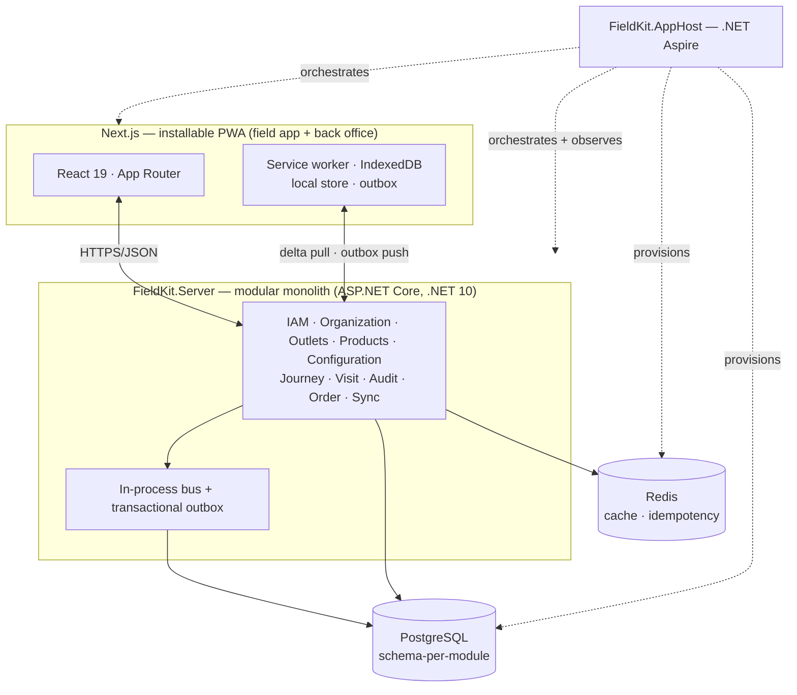

# FieldKit

**A Sales Force Automation (SFA) platform for FMCG field sales — built as a modular monolith
on .NET Aspire with an offline-first Next.js front end.**

> Field sales reps walk into stores with no signal, check the shelf, fix what's wrong, and
> take the next order. FieldKit is the tool in their hand and the platform their managers run
> the operation from — and it keeps working when the network doesn't.

<!-- badges: build · coverage · license — add once CI is wired -->

**[Live demo](https://webfrontend.jollysmoke-c6d79515.swedencentral.azurecontainerapps.io)** — Azure
Container Apps, Sweden Central. Sign in with workspace `fieldkit-dev`. It scales to zero when idle,
so the first request after a quiet spell takes a few seconds.

> The demo database is **empty on purpose**: schema comes from migrations and the only seeded rows
> are the tenants and their role templates. Nothing seeds outlets or products, so the screens show
> their empty states rather than a fixture nobody chose.

---

## Why this project

I build SFA software professionally for FMCG multinationals. FieldKit is a from-scratch take
on that domain, built to demonstrate **architecture and full-stack engineering** end to end,
and to go deep on three things that make SFA genuinely hard and genuinely interesting:

- **Modular monolith** — ten domain modules with enforced boundaries, own schemas, and a
  microservices-ready seam, kept honest by architecture tests.
- **Offline-first sync** — a purpose-built sync engine: local store, outbox, delta pull,
  idempotent push, documented conflict resolution. Reps work fully offline; the platform
  reconciles on reconnect.
- **Cloud-native .NET with Aspire** — the API, front end, PostgreSQL, and Redis composed and
  observed through .NET Aspire, with OpenTelemetry traces/metrics/logs out of the box.

The domain isn't decoration: field sales is offline, multi-tenant, and rules-heavy, so it
*earns* this architecture instead of over-engineering a toy.

## Architecture at a glance



Full write-up: **[docs/architecture/00-architecture-overview.md](docs/architecture/00-architecture-overview.md)**.

## Tech stack

| Area | Stack |
|---|---|
| Orchestration | .NET Aspire (AppHost) |
| Backend | ASP.NET Core Minimal APIs · .NET 10 · EF Core · FluentValidation |
| Data | PostgreSQL (schema-per-module) · Redis |
| Messaging | In-process bus + transactional outbox |
| Frontend | Next.js (App Router) · React 19 · TypeScript · TanStack Query |
| Offline | Service worker (Workbox) · IndexedDB (Dexie) · PWA |
| Observability | OpenTelemetry → Aspire dashboard |
| Testing | xUnit · Testcontainers · NetArchTest · Playwright · Vitest |
| CI/CD | GitHub Actions |

## Documentation

FieldKit is documented as a first-class deliverable — functional specs, technical design,
and decision records:

- 📘 **[Documentation index](docs/README.md)** — start here
- 🎯 **[Product overview](docs/product/00-product-overview.md)** — vision, personas, capabilities, scope
- 🏛️ **[Architecture overview](docs/architecture/00-architecture-overview.md)** — C4, module map, stack
- 🧭 **[Decision records (ADRs)](docs/architecture/adr/README.md)** — the "why" behind every big call
- 🖼️ **[Wireframes](docs/ux/README.md)** — the field-app golden path + back office ([interactive](https://claude.ai/code/artifact/e97b6c9d-43bb-4631-aae9-3c95104a12d0))
- 🗺️ **[Roadmap](docs/roadmap.md)** — what's built and what's next

## Repository layout

```
FieldKit/
├─ FieldKit.AppHost/         # .NET Aspire orchestration (composition root)
├─ FieldKit.Server/          # the host — composes modules, no domain logic
├─ FieldKit.Web/             # module-hosting abstraction (IModule)
├─ FieldKit.SharedKernel/    # value objects (Money, GeoPoint, IClock, Result, TenantId)
├─ FieldKit.BuildingBlocks/  # pure abstractions (messaging, tenancy, AggregateRoot)
├─ FieldKit.Infrastructure/  # EF base (schema-per-module), interceptors, outbox
├─ FieldKit.Modules.Products/# the first domain module (W1's `Catalog`, grown into Products & Pricing)
├─ frontend/                 # Next.js field app + back office
├─ docs/                     # functional + technical documentation
└─ FieldKit.slnx
```

## Running it (dev)

> The system is orchestrated by .NET Aspire — one command brings up the API, front end,
> PostgreSQL, Redis, and the telemetry dashboard.

```bash
dotnet run --project FieldKit.AppHost
```

Then open the **Aspire dashboard** URL printed in the console to see every service, its logs,
and live traces. *(Prerequisites and the current run state are tracked in the
[roadmap](docs/roadmap.md) — the app is under active construction from the scaffold.)*

## Status

🚧 **Phase 0 — foundation nearly complete.** The modular monolith **runs**: Aspire boots the Server
on PostgreSQL, and the first module (`Products`, built in W1 as `Catalog`) answers `POST`/`GET
/api/products` end-to-end, with
schema-per-module isolation, a transactional outbox, and architecture tests enforcing the
boundaries — all verified against real Postgres in CI. Remaining Phase 0: per-module EF migrations,
and the Vite → Next.js front-end migration. See the [roadmap](docs/roadmap.md) and
[delivery plan](docs/delivery-plan.md).

## About

Built by **Vasile-Tiberiu Socea** — Senior Full-Stack Developer (.NET & modern JS/TS).
[LinkedIn](https://linkedin.com/in/socea-tiberiu)
