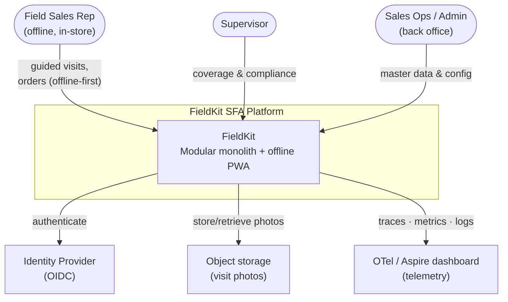
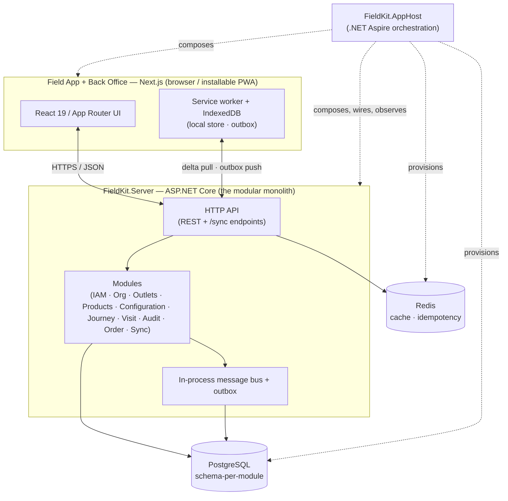
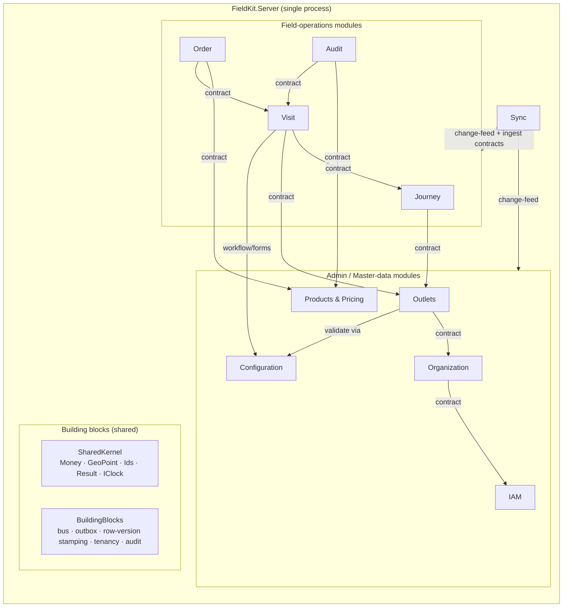
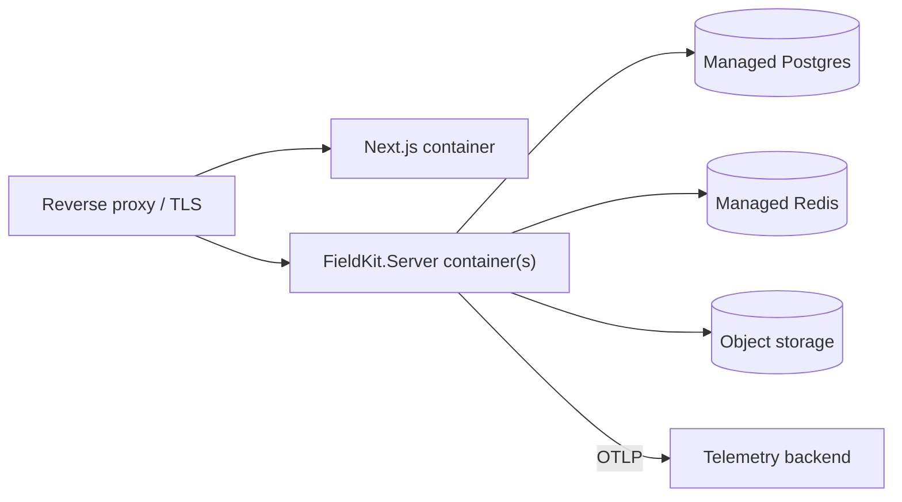

# Architecture Overview

> **Status:** ✅ Baseline · **Scope:** whole system · **Last updated:** 2026-07

This document is the map. It describes FieldKit's architecture top-down using the
[C4 model](https://c4model.com/) (context → containers → components), then the module
decomposition, the technology stack, the cross-cutting concerns, and the deployment
topology. Deeper documents (module boundaries, domain model, sync engine, etc.) hang off
this one; decisions are justified in the [ADRs](adr/README.md).

## 1. Architectural drivers

The architecture is shaped by a small number of forces that actually matter for SFA:

| Driver | Consequence |
|---|---|
| **Field reps work offline** | The client must be a self-sufficient offline app with a real sync protocol — not a thin UI over an API. This is the single biggest driver. |
| **Multi-tenant SaaS** | Tenant isolation must be enforced at the data layer and carried through every request. |
| **Rules-heavy, evolving domain** | Clear domain boundaries and invariants; the ability to change one area (e.g. pricing) without destabilising another (e.g. journeys). |
| **Solo build, small footprint** | One deployable, one database. Operational simplicity beats premature distribution — but boundaries are kept clean enough to split later if ever needed. |
| **Portfolio: legibility** | The architecture must be *explainable*. Enforced boundaries and decision records are part of the deliverable, not overhead. |

The dominant decision that falls out of these: a **modular monolith**, not microservices
(see [ADR-0002](adr/0002-modular-monolith.md)).

## 2. C4 — Level 1: System context

FieldKit is one system to its users. Externally it depends only on an OIDC identity
provider, object storage for photos, and a telemetry sink. Everything else is internal.

## 3. C4 — Level 2: Containers

A **container** in C4 is a separately runnable/deployable thing. FieldKit is deliberately
lean: two application containers plus backing services, all composed by **.NET Aspire**.

**Containers**

| Container | Tech | Responsibility |
|---|---|---|
| **FieldKit.AppHost** | .NET Aspire | Composition root: provisions Postgres & Redis, wires connection strings/service discovery, runs the front end, aggregates telemetry into the Aspire dashboard. *Dev-time orchestrator; in prod emits a deployable manifest.* |
| **FieldKit.Server** | ASP.NET Core (.NET 10) | The modular monolith. Hosts all domain modules in one process, exposes the HTTP API and the sync endpoints. |
| **Field app / Back office** | Next.js (App Router) | One Next.js app serving both the offline field PWA and the back-office console. |
| **PostgreSQL** | Postgres 16 | System of record. One database, **one schema per module** for isolation. |
| **Redis** | Redis | Output/response cache and idempotency-key store for the sync push path. |

> Today the front end is scaffolded with **Vite**; migrating it to **Next.js** is tracked
> in [ADR-0004](adr/0004-nextjs-offline-first-frontend.md) and Phase 0 of the
> [roadmap](../roadmap.md).

## 4. Module decomposition

Inside `FieldKit.Server`, the system is split into **modules** — each a bounded context
with its own domain model, its own database schema, and a **public contract** that is the
*only* way other modules may talk to it. This is the heart of the modular-monolith design;
the rules that keep it honest are in [module boundaries](10-module-boundaries.md).

| Module | Owns | Talks to (via contract/events) |
|---|---|---|
| **IAM** | Users, roles, permissions, tenant membership | — (foundational) |
| **Organization** | Org hierarchy, territories, route assignment | IAM |
| **Outlets** | Retail outlets, channels, segments, geo, contacts | Organization, Configuration |
| **Products & Pricing** | Catalog, assortments, price lists, promotions | Outlets, Configuration |
| **Configuration** | Custom-field definitions, visit-workflow, survey/audit forms, perfect-store weights, theme tokens | IAM |
| **Journey** | Call schedules, frequency, the daily journey | Outlets, Organization |
| **Visit** | Visit lifecycle, check-in/out, config-driven steps, geofence | Journey, Outlets, Configuration |
| **Audit** | Structured shelf audit: availability, share-of-shelf, price checks, surveys, photos, perfect-store score | Visit, Products, Configuration |
| **Order** | Order capture, promotion application, order lifecycle | Visit, Products, Configuration |
| **Sync** | Delta computation, push ingestion, conflict resolution, device registry | Other modules **only via their `IReferenceChangeFeed` (pull) and `I…Ingest` (push) contracts** |

> **Reporting is not a module.** Supervisor/ops dashboards are composed from each module's
> **query contracts** (`IVisitQuery`, `IAuditQuery`, `IOrderQuery`, …) plus integration events
> — the read side of the modules that already exist. See
> [product overview → Reporting & KPIs](../product/00-product-overview.md#reporting--kpis-cross-cutting-read-side).

> **Sync talks only through contracts.** Sync never reads another schema. Each reference module
> implements **`IReferenceChangeFeed`** (territory-scoped, row-version delta + tombstones + high-
> water mark) for the pull path, and each field module implements **`I…Ingest`** (create/resubmit)
> for the push path — so domain rules run in the owning module. The per-tenant **row-version**
> stamping interceptor lives in `BuildingBlocks`; the version *columns* live in each module's
> schema. Detail: [sync engine](12-offline-sync-engine.md), [module boundaries §7](10-module-boundaries.md#7-module-registry).

**Shared building blocks** (not domain modules): `SharedKernel` (dependency-free value
objects, `IClock`, result types) and `BuildingBlocks` (the in-process bus, transactional outbox,
row-version stamping, multi-tenancy filter, and audit interceptor).

### Communication rules (summary)

- **Synchronous, same request:** call another module through its **public contract**
  interface (e.g. `IProductCatalog`). Never reach into another module's internals or tables.
- **Asynchronous, across a boundary:** publish a **domain/integration event** on the
  in-process bus; the [outbox](adr/0006-in-process-messaging-and-outbox.md) makes delivery
  reliable within the same DB transaction.
- **Enforced by tests:** [architecture tests](17-testing-strategy.md) fail the build if a
  module references another module's internal namespace.

This is what makes it *modular*: the same discipline a microservices split would force, but
without the network, the distributed transactions, or the ops cost — and with a clean seam
to extract a module into its own service later if a real driver ever appears.

## 5. Technology stack

| Layer | Choice | Why (short) |
|---|---|---|
| Orchestration | **.NET Aspire** | Cloud-native composition, service discovery, and built-in OTel dashboard ([ADR-0003](adr/0003-adopt-dotnet-aspire.md)) |
| API host | **ASP.NET Core Minimal APIs**, .NET 10 | Low-ceremony HTTP surface per module |
| Persistence | **EF Core + PostgreSQL (Npgsql)** | Mature ORM; Postgres for schema-per-module & rich types ([ADR-0005](adr/0005-postgres-schema-per-module.md)) |
| Messaging | **In-process bus + transactional outbox** | Reliable cross-module events without a broker ([ADR-0006](adr/0006-in-process-messaging-and-outbox.md)) |
| Validation | **FluentValidation** | Declarative request/command validation |
| Front end | **Next.js (App Router) + React 19 + TypeScript** | Modern full-stack React; installable PWA |
| Offline store | **IndexedDB (Dexie) + Workbox service worker** | Durable local store & caching for offline-first ([ADR-0007](adr/0007-offline-sync-strategy.md)) |
| Server state (client) | **TanStack Query** | Cache/reconcile server data; pairs with the sync layer |
| Cache / idempotency | **Redis** | Response cache + idempotency keys on sync push |
| Auth | **OIDC / JWT bearer** | Standard SaaS authentication ([ADR-0008](adr/0008-authentication-and-multitenancy.md)) |
| Testing | **xUnit · Testcontainers · NetArchTest · Playwright · Vitest** | Real-Postgres integration + boundary + E2E ([testing strategy](17-testing-strategy.md)) |
| CI/CD | **GitHub Actions → containers** | Build, test, arch-test, publish |

## 6. Cross-cutting concerns

| Concern | Approach | Deep dive |
|---|---|---|
| **Multi-tenancy** | `TenantId` on every tenant-owned row; EF Core global query filter; tenant resolved from the token and flowed via an ambient `ITenantContext` | [security](16-security.md), [data](14-data-and-persistence.md) |
| **AuthN/AuthZ** | OIDC login; JWT bearer to the API; permission-based authorization checked in module handlers | [ADR-0008](adr/0008-authentication-and-multitenancy.md) |
| **Observability** | OpenTelemetry traces/metrics/logs via Aspire service defaults; custom domain metrics (visits synced, orders captured, sync latency) | [observability](15-observability.md) |
| **Idempotency** | Client-generated mutation IDs; server dedupes on the sync push path via Redis + a persisted ledger | [sync engine](12-offline-sync-engine.md) |
| **Auditing** | EF Core save interceptor stamps created/modified + actor; domain events for meaningful changes | [data](14-data-and-persistence.md) |
| **Error model** | RFC 7807 `ProblemDetails` everywhere; typed error codes in the contract | [API contracts](13-api-contracts.md) |
| **Resilience** | Standard resilience handlers on outbound HTTP (Aspire service defaults) | [observability](15-observability.md) |

## 7. Deployment topology

**Development** — `dotnet run` on the AppHost brings up the whole system: Postgres and Redis
as containers, the Server, the Next.js app, and the Aspire dashboard for traces/logs/metrics.
One command, no local install of Postgres/Redis needed.

**Production (target)** — the AppHost publishes a deployment manifest; the Server and Next.js
app run as containers, backed by managed Postgres and Redis, behind a reverse proxy that
terminates TLS. Telemetry ships to an OTLP-compatible backend. Because it is a monolith, a
"deploy" is a single rolling image update.

Horizontal scale is by running multiple `FieldKit.Server` replicas behind the proxy; the
outbox and idempotency design keep this safe under concurrency (see
[sync engine](12-offline-sync-engine.md)). With multiple replicas, the outbox dispatcher, the
idempotency-ledger writes, and the device registry all use **`SELECT … FOR UPDATE SKIP LOCKED`**
(or a leader) so a row is dispatched/applied by exactly one replica — at-least-once + idempotency
covers correctness, `SKIP LOCKED` avoids double work ([ADR-0006](adr/0006-in-process-messaging-and-outbox.md)).
A reconnect burst (many reps hitting signal at shift start) is smoothed by push **batch-size caps**
and warm-up rather than relying on scale-from-zero.

## 8. Where to go next

- **Why a monolith and how it's kept modular** → [ADR-0002](adr/0002-modular-monolith.md),
  [module boundaries](10-module-boundaries.md)
- **The hard part** → [offline sync engine](12-offline-sync-engine.md)
- **What gets built when** → [roadmap](../roadmap.md)
