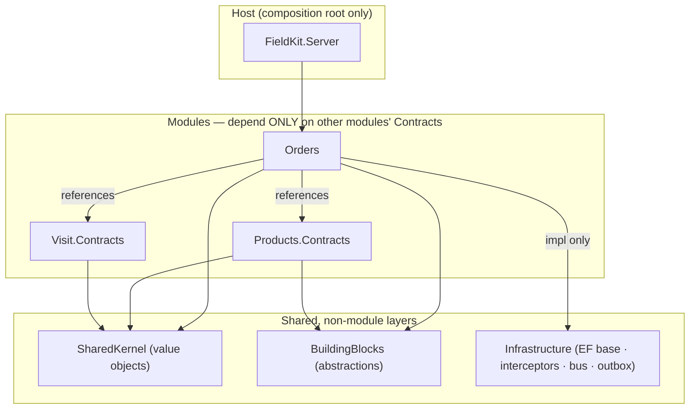
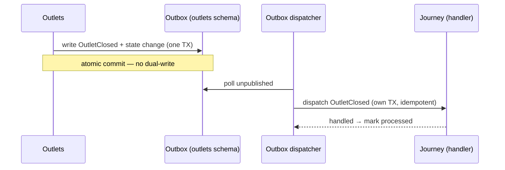

# Module Boundaries

> **Status:** ✅ Baseline · **Showcase:** modular monolith · **Last updated:** 2026-08
> **Decisions:** [ADR-0002](adr/0002-modular-monolith.md) · [ADR-0005](adr/0005-postgres-schema-per-module.md) · [ADR-0006](adr/0006-in-process-messaging-and-outbox.md)

A modular monolith is only "modular" if the boundaries are **real and enforced**. This document
turns the principle from [ADR-0002](adr/0002-modular-monolith.md) into something concrete: the
project layout, the visibility rules, the exact shape of a module and its contract, the two ways
modules communicate, and the **architecture-test suite** that fails the build when a boundary is
crossed. This is the difference between "we intend to keep modules separate" and "the compiler
and CI won't let us not."

## 1. Anatomy of a module

Every domain module has the same internal shape. Only the **Contracts** are visible to the
outside world; everything else is `internal`.

```
FieldKit.Modules.Orders/
├─ Contracts/                 ← PUBLIC. The only thing other modules may reference.
│  ├─ IOrderQuery.cs
│  ├─ Dtos/…                  ← plain data shapes crossing the boundary
│  └─ IntegrationEvents/      ← events this module publishes (OrderSubmitted, …)
│
├─ Domain/                    ← internal. Aggregates, entities, value objects, invariants.
│  ├─ Order.cs                (internal sealed)
│  ├─ OrderLine.cs
│  └─ …
├─ Application/               ← internal. Use-case handlers (commands/queries), validation.
├─ Infrastructure/            ← internal. EF Core DbContext (schema "order"), repositories.
├─ Api/                       ← internal. Minimal-API endpoint mappings for this module.
└─ OrdersModule.cs            ← the module's composition root (DI + endpoint registration)
```

**Rules that make this a boundary, not a folder:**

1. **One assembly (project) per module.** Boundaries are assembly boundaries — the strongest
   enforcement .NET gives, and what architecture tests inspect.
2. **`Contracts/` is the public API.** Types outside `Contracts/` are `internal` — physically
   unreferenceable from other modules.
3. **Contracts expose behavior and DTOs, never domain entities.** An aggregate (`Order`) never
   leaves its module; a `OrderSummaryDto` does. Prevents another module binding to your internals.
4. **Own schema, own `DbContext`** (`order` schema, [ADR-0005](adr/0005-postgres-schema-per-module.md)).
5. **Self-registration.** `OrdersModule` wires its own DI and endpoints; the host just calls
   `AddOrdersModule()` / `MapOrdersModule()` — the host knows modules exist, not how they work.

## 2. The dependency rule



- A module may reference **another module's `Contracts` project only** — never its
  implementation assembly.
- **Three shared layers, split by purity so `Contracts` stay lightweight:**
  **`SharedKernel`** (dependency-free value objects: `Money`, `GeoPoint`, strongly-typed ids,
  `Result`, `IClock`); **`BuildingBlocks`** (pure *abstractions*: messaging contracts,
  `ITenantContext`, `ITenantOwned`/`IAuditable`, the `IReferenceChangeFeed`/`I…Ingest` shapes); and
  **`Infrastructure`** (EF Core base `ModuleDbContext`, stamping interceptors, and — as they land —
  the bus/outbox implementations). A module's **`Contracts`** reference only `SharedKernel` +
  `BuildingBlocks`; its **implementation** may also reference `Infrastructure`.
- **Building blocks never reference a module.** Dependencies point inward/toward shared, never
  from infrastructure to domain.
- The **host references every module** (to compose them) and nothing references the host.

To keep even the `Contracts` reference honest, contracts are split into a separate small project
(`Orders.Contracts`) so a consumer takes a dependency on the **interface, not the code behind
it** — the seam that lets a module later become a remote service.

## 3. How modules communicate

Per [ADR-0006](adr/0006-in-process-messaging-and-outbox.md), **"call for answers, publish for
facts."**

### 3a. Synchronous — a contract call
Order needs a price *now*:

```csharp
// in Orders (Application) — depends on Products.Contracts only
var price = await _pricing.ResolvePriceAsync(outletId, productId, qty, date, ct);
```

`IPricingService` is implemented inside Products; DI binds it; the call is in-process and joins
the current transaction. Order never sees a Products entity — only the DTO the contract returns.

### 3b. Asynchronous — an integration event
Outlets closes an outlet; Journey must react, but Outlets must not know Journey exists:



The event type lives in `Outlets.Contracts/IntegrationEvents`; Journey references it and
registers a handler. Delivery is **at-least-once**; the handler is idempotent.

## 4. What crosses a boundary (and what never does)

| Crosses the boundary | Never crosses |
|---|---|
| Contract **interfaces** (`IOrderQuery`) | Domain **entities/aggregates** (`Order`, `OrderLine`) |
| **DTOs** in `Contracts/Dtos` | EF Core `DbContext` / repositories |
| **Integration events** in `Contracts/IntegrationEvents` | Another module's tables (no cross-schema SQL) |
| Strongly-typed **ids** & `SharedKernel` value objects | Internal services, handlers, validators |

## 5. Enforcement — architecture tests

Boundaries that rely on goodwill rot. FieldKit encodes them as **executable tests**
(NetArchTest / ArchUnitNET) that run in CI and fail the build on violation. Representative rules:

| # | Rule | Intent |
|---|---|---|
| AT-1 | No module implementation assembly may reference another module's **implementation** assembly (only its `.Contracts`). | The core boundary. |
| AT-2 | Types outside a module's `Contracts` namespace are `internal`. | Contracts are the only public surface. |
| AT-3 | No type in `Contracts` exposes a `Domain` type (return/param). | Entities never leak. |
| AT-4 | `BuildingBlocks`/`SharedKernel` reference **no** module. | Dependencies point inward. |
| AT-5 | Each module's `DbContext` maps only its own schema. | Data isolation ([ADR-0005](adr/0005-postgres-schema-per-module.md)). |
| AT-6 | Integration-event handlers are idempotent-by-construction (registered via the bus, not called directly). | At-least-once safety. |
| AT-7 | No `DateTime.Now`/`DateTimeOffset.Now`; only an injected `IClock` (UTC). | Testability + [i18n/timezone](adr/0010-internationalization.md). |
| AT-8 | Domain layer references no EF Core / ASP.NET types. | Keep the domain pure. |
| AT-9 | No `IgnoreQueryFilters` or `ExecuteSqlRaw` in production code. | The tenant filter is the isolation guarantee ([ADR-0008](adr/0008-authentication-and-multitenancy.md), BR-IAM-1). |

**Two enforcement mechanisms, not one.** AT-1…AT-6 and AT-8 are *tests* — they inspect assemblies,
so they need the assemblies to exist. **AT-7 and AT-9 are compile-time**, via the banned-API
analyzer: banning a symbol outright is stronger than asserting nobody used it, because the failure
lands on the developer who typed it rather than on CI minutes later.

Both are wired in [`Directory.Build.props`](../../Directory.Build.props), so a new module inherits
them at creation instead of when someone remembers to copy a `csproj` fragment. `RS0030` is escalated
to an **error**; left as a warning these would be suggestions, and one of them is the tenant-isolation
bypass.

**Test projects are exempt from AT-9**, deliberately: proving the tenant filter works means being
able to look past it. A test that could only query *through* the filter would be asserting the filter
against itself — so `PersistenceIntegrationTests` uses `IgnoreQueryFilters` to show the hidden row is
physically present and correctly stamped.

```csharp
// Example (NetArchTest): AT-1
var result = Types.InAssembly(typeof(OrdersModule).Assembly)
    .That().ResideInNamespace("FieldKit.Modules.Orders")
    .ShouldNot().HaveDependencyOnAny(
        "FieldKit.Modules.Products.Domain",
        "FieldKit.Modules.Products.Infrastructure")   // …every other module's internals
    .GetResult();
Assert.True(result.IsSuccessful, string.Join("\n", result.FailingTypeNames));
```

These tests are part of the [testing strategy](17-testing-strategy.md) and gate every PR.

## 6. The extraction path (why this buys optionality)

If a genuine driver ever demanded splitting a module into its own service, the boundary is
already the seam:

1. Consumers already depend on `X.Contracts` (an interface), not on X's code.
2. The interface implementation swaps from an in-process call to a remote client (HTTP/gRPC).
3. Async events already flow through an outbox — repoint it at a real broker
   ([ADR-0006](adr/0006-in-process-messaging-and-outbox.md)).
4. The module already owns its schema — lift it to its own database
   ([ADR-0005](adr/0005-postgres-schema-per-module.md)).

Nothing in the domain changes. This is the payoff of "microservices-ready, not microservices":
we hold the option without paying to exercise it.

## 7. Module registry

| Module | Assembly | Schema | Key contracts | Publishes |
|---|---|---|---|---|
| IAM | `…Modules.Iam` (+ `.Contracts`) | `iam` | `IUserDirectory`, `ITenantRegistry` | `UserDeactivated` |
| Organization | `…Modules.Org` | `org` | `ITerritoryDirectory`, `IRepScope`, `IOrgHierarchy` | `RepAssignmentChanged` |
| Outlets | `…Modules.Outlets` | `outlets` | `IOutletCatalog`, `IOutletClassification`, `IReferenceChangeFeed`, `IOutletProposalIngest` | `OutletChanged`, `OutletClosed` |
| Products & Pricing | `…Modules.Products` | `products` | `IProductCatalog`, `IAssortmentService`, `IPricingService`, `IReferenceChangeFeed` | `PriceListPublished`, `PromotionActivated` |
| Configuration | `…Modules.Configuration` | `config` | `IFieldDefinitionCatalog`, `IVisitWorkflow`, `ISurveyForms`, `IScoreWeights`, `IReferenceChangeFeed` | `ConfigurationPublished` |
| Journey | `…Modules.Journey` | `journey` | `IJourneyQuery`, `IReferenceChangeFeed`, `IJourneyIngest` | `JourneyPublished`, `PlannedVisitMarkedNotVisited` |
| Visit | `…Modules.Visit` | `visit` | `IVisitContext`, `IVisitQuery`, `IVisitIngest` | `VisitCompleted` |
| Audit | `…Modules.Audit` | `audit` | `IAuditQuery`, `IPerfectStoreScore`, `IAuditIngest` | `AuditCompleted` |
| Order | `…Modules.Orders` | `order` | `IOrderQuery`, `IOrderIngest` | `OrderSubmitted` |
| Sync | `…Modules.Sync` | `sync` | `ISyncEndpoints` (pull/push) | `DeviceRegistered` |

**Ten modules.** Contracts and events map 1:1 to the [functional specs'](../product/00-product-overview.md)
module contract sections — the functional "what" and the technical "how" stay in lockstep.

**Each module is two assemblies:** `FieldKit.Modules.X` (implementation, private) and
`FieldKit.Modules.X.Contracts` (its only public surface). IAM is the first built this way and sets
the pattern; **Catalog predates it and is still a single assembly** — a retrofit, not a second rule.
**Organization is single-assembly for now on purpose**, which is a different case from Catalog's:
every contract in its registry row describes something that does not exist yet (the management line
needs positions, territories need outlets), and an interface designed before its consumer is a guess
other modules then have to live with. Its `.Contracts` assembly lands with its first contract.
The split is what lets AT-1 be a real reference check rather than a naming convention, and it makes
AT-3 structural: a contracts assembly that cannot see the implementation cannot name a domain type
in a signature.

> Two registry entries are not where an earlier draft placed them, and the difference is deliberate.
> **`ITenantContext` lives in `BuildingBlocks`**, not `Iam.Contracts`: every module needs it on every
> request, and routing that through a module contract would make the most cross-cutting primitive in
> the system depend on one module's assembly. **`IAuthorizationService`** is not a FieldKit interface
> at all — permission checks are `ITenantContext.Has` plus the `RequirePermission` endpoint
> convention, both fed from the token, so introducing a service that could answer differently from
> the request's own token would be a hazard rather than a feature.

**Two sync-specific contract families** keep [ADR-0002](adr/0002-modular-monolith.md)'s "no cross-
schema access" honest (resolves finding S3):
- **`IReferenceChangeFeed`** — implemented by every reference module (Outlets, Products,
  Configuration, Journey). Returns a **territory-scoped, `rowVersion > cursor` delta with
  tombstones and a new high-water mark**. Sync composes these; it never reads another schema. The
  row-version **stamping interceptor** lives in `Infrastructure`; the version *columns* live in
  each module's own schema ([data & persistence](14-data-and-persistence.md#4-keys-concurrency-timestamps)).
- **`I…Ingest`** — the **push** path, one per module that receives device-created mutations:
  `IVisitIngest`, `IAuditIngest`, `IOrderIngest`, **`IJourneyIngest`** (not-visited / unplanned /
  reschedule annotations, [Journey §7](../product/20-journey-planning.md#7-offline-behavior)), and
  **`IOutletProposalIngest`** (field-originated outlet corrections/new-outlet requests →
  review queue, [Outlets §7](../product/12-outlets-master-data.md#7-offline-behavior)). Sync applies
  each pushed mutation *through* the owning module so its domain invariants run server-side
  (assortment, outlet-open, permissions, price re-check) — "apply through contracts, not tables"
  ([sync engine §4](12-offline-sync-engine.md#4-push-protocol-device-owned-mutations)).

> **Where these interfaces live.** `IReferenceChangeFeed` and the `I…Ingest` *shape* are declared
> once in `BuildingBlocks` (each is generic over the module's DTO); modules depend on `BuildingBlocks`
> and implement them, and `BuildingBlocks` references no module — so this stays within the dependency
> rule (§2). Sync composes the implementations by DI, keying deltas per entity type.
