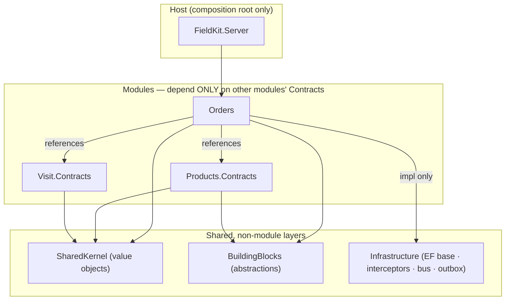
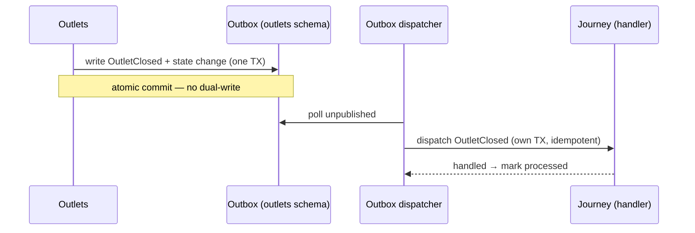

# Module Boundaries

> **Status:** ✅ Baseline · **Showcase:** modular monolith · **Last updated:** 2026-08
> **Decisions:** [ADR-0002](adr/0002-modular-monolith.md) · [ADR-0005](adr/0005-postgres-schema-per-module.md) · [ADR-0006](adr/0006-in-process-messaging-and-outbox.md)

A modular monolith is only "modular" if the boundaries are **real and enforced**. This document
turns the principle from [ADR-0002](adr/0002-modular-monolith.md) into something concrete: the
project layout, the visibility rules, the exact shape of a module and its contract, the two ways
modules communicate, and the **architecture-test suite** that fails the build when a boundary is
crossed. This is the difference between "we intend to keep modules separate" and "the compiler
and CI won't let us not."

## 1. Anatomy of a module

Every domain module has the same internal shape. Only the **Contracts** are visible to the
outside world; everything else is `internal`.

```
FieldKit.Modules.Orders/
├─ Contracts/                 ← PUBLIC. The only thing other modules may reference.
│  ├─ IOrderQuery.cs
│  ├─ Dtos/…                  ← plain data shapes crossing the boundary
│  └─ IntegrationEvents/      ← events this module publishes (OrderSubmitted, …)
│
├─ Domain/                    ← internal. Aggregates, entities, value objects, invariants.
│  ├─ Order.cs                (internal sealed)
│  ├─ OrderLine.cs
│  └─ …
├─ Application/               ← internal. Use-case handlers (commands/queries), validation.
├─ Infrastructure/            ← internal. EF Core DbContext (schema "order"), repositories.
├─ Api/                       ← internal. Minimal-API endpoint mappings for this module.
└─ OrdersModule.cs            ← the module's composition root (DI + endpoint registration)
```

**Rules that make this a boundary, not a folder:**

1. **One assembly (project) per module.** Boundaries are assembly boundaries — the strongest
   enforcement .NET gives, and what architecture tests inspect.
2. **`Contracts/` is the public API.** Types outside `Contracts/` should be `internal` — physically
   unreferenceable from other modules. This is the intent, and it is **not** what AT-2 checks:
   [§5](#5-enforcement--architecture-tests) enforces the narrower rule that contract
   *implementations* are internal, and several modules have public types that would fail the broader
   one. AT-1 is what actually makes the boundary hold, because it is an assembly-reference check.
3. **Contracts expose behavior and DTOs, never domain entities.** An aggregate (`Order`) never
   leaves its module; a `OrderSummaryDto` does. Prevents another module binding to your internals.
4. **Own schema, own `DbContext`** (`order` schema, [ADR-0005](adr/0005-postgres-schema-per-module.md)).
5. **Self-registration.** `OrdersModule` wires its own DI and endpoints; the host just calls
   `AddOrdersModule()` / `MapOrdersModule()` — the host knows modules exist, not how they work.

## 2. The dependency rule



- A module may reference **another module's `Contracts` project only** — never its
  implementation assembly.
- **Three shared layers, split by purity so `Contracts` stay lightweight:**
  **`SharedKernel`** (dependency-free value objects: `Money`, `GeoPoint`, strongly-typed ids,
  `Result`, `IClock`); **`BuildingBlocks`** (pure *abstractions*: messaging contracts,
  `ITenantContext`, `ITenantOwned`/`IAuditable`, the `IReferenceChangeFeed`/`I…Ingest` shapes); and
  **`Infrastructure`** (EF Core base `ModuleDbContext`, stamping interceptors, and — as they land —
  the bus/outbox implementations). A module's **`Contracts`** reference only `SharedKernel` +
  `BuildingBlocks`; its **implementation** may also reference `Infrastructure`.
- **Building blocks never reference a module.** Dependencies point inward/toward shared, never
  from infrastructure to domain.
- The **host references every module** (to compose them) and nothing references the host.

To keep even the `Contracts` reference honest, contracts are split into a separate small project
(`Orders.Contracts`) so a consumer takes a dependency on the **interface, not the code behind
it** — the seam that lets a module later become a remote service.

## 3. How modules communicate

Per [ADR-0006](adr/0006-in-process-messaging-and-outbox.md), **"call for answers, publish for
facts."**

### 3a. Synchronous — a contract call
Order needs a price *now*:

```csharp
// in Orders (Application) — depends on Products.Contracts only
var price = await _pricing.ResolvePriceAsync(outletId, productId, qty, date, ct);
```

`IPricingService` is implemented inside Products; DI binds it; the call is in-process and joins
the current transaction. Order never sees a Products entity — only the DTO the contract returns.

### 3b. Asynchronous — an integration event
Outlets closes an outlet; Journey must react, but Outlets must not know Journey exists:



The event type lives in `Outlets.Contracts/IntegrationEvents`; Journey references it and
registers a handler. Delivery is **at-least-once**; the handler is idempotent.

## 4. What crosses a boundary (and what never does)

| Crosses the boundary | Never crosses |
|---|---|
| Contract **interfaces** (`IOrderQuery`) | Domain **entities/aggregates** (`Order`, `OrderLine`) |
| **DTOs** in `Contracts/Dtos` | EF Core `DbContext` / repositories |
| **Integration events** in `Contracts/IntegrationEvents` | Another module's tables (no cross-schema SQL) |
| Strongly-typed **ids** & `SharedKernel` value objects | Internal services, handlers, validators |

## 5. Enforcement — architecture tests

Boundaries that rely on goodwill rot. FieldKit encodes them as **executable tests**
(NetArchTest / ArchUnitNET) that run in CI and fail the build on violation. Representative rules:

| # | Rule | Intent |
|---|---|---|
| AT-1 | No module implementation assembly may reference another module's **implementation** assembly (only its `.Contracts`). | The core boundary. |
| AT-2 | A module's **contract implementations** are `internal` — nothing outside can bind to a concrete one. | Contracts are the only public surface. |
| AT-3 | No type in `Contracts` exposes a `Domain` type (return/param). | Entities never leak. |
| AT-4 | `BuildingBlocks`/`SharedKernel` reference **no** module. | Dependencies point inward. |
| AT-5 | Each module's `DbContext` maps only its own schema. | Data isolation ([ADR-0005](adr/0005-postgres-schema-per-module.md)). |
| AT-6 | Integration-event handlers are idempotent-by-construction (registered via the bus, not called directly). | At-least-once safety. |
| AT-7 | No `DateTime.Now`/`DateTimeOffset.Now`; only an injected `IClock` (UTC). | Testability + [i18n/timezone](adr/0010-internationalization.md). |
| AT-8 | Domain layer references no EF Core / ASP.NET types. | Keep the domain pure. |
| AT-9 | No `IgnoreQueryFilters` or `ExecuteSqlRaw` in production code. | The tenant filter is the isolation guarantee ([ADR-0008](adr/0008-authentication-and-multitenancy.md), BR-IAM-1). |
| AT-10 | The graph of **contract implementations depending on other modules' contracts** is acyclic. | Two modules may reference each other's contracts; their *implementations* may not call in a circle. |
| AT-11 | Every module and every `.Contracts` project **in the solution** is one the tests above actually check. | A gate cannot see what it was never given; this is the gate on the gates. |
| AT-12 | A module with an `ISyncTracked` entity **owns the sync tables**, and one that owns them **has something to number**. | The row-version counter and tombstone table are opt-in per module (ADR-0013); forgetting the flag fails at the first write, not at build. |

**Two enforcement mechanisms, and a third category that is neither.**

- ***Tests*** — AT-1, AT-2, AT-3, AT-4, AT-8, AT-10, AT-11 and AT-12, in
  [`FieldKit.ArchitectureTests`](../../FieldKit.ArchitectureTests). They inspect assemblies, so they
  need the assemblies to exist.
- ***Compile-time*** — AT-7 and AT-9, via the banned-API analyzer. Banning a symbol outright is
  stronger than asserting nobody used it, because the failure lands on the developer who typed it
  rather than on CI minutes later.
- ***Neither, yet*** — **AT-5 and AT-6 have no test and no analyzer.** Both hold today by
  construction: every `DbContext` derives from `ModuleDbContext`, which sets one schema
  ([ADR-0005](adr/0005-postgres-schema-per-module.md)), and there are no integration-event handlers
  to register wrongly until Sync (W8). Neither is checked, so both are conventions rather than gates,
  and AT-6 in particular should get its test with the first handler rather than after.

> **This list said "AT-1…AT-6" until a pre-W7 audit counted the tests.** AT-5 and AT-6 were never
> written, and AT-2 was written narrower than the rule above it claimed — the test asserts contract
> *implementations* are internal, not that every type outside `Contracts` is. The rule has been
> narrowed to what is enforced rather than the enforcement being described as wider than it is; the
> broader ambition is real but is not a gate, and Products has ~60 public types that would fail it.
> A registry that overstates its surface is the failure this document was already corrected for once
> — the same applies to a gate list.

> **AT-11 exists because the same failure happened again, one level down.** Every test above starts
> from a list of assemblies somebody typed, and completeness is the one property none of them can
> observe: an assembly nobody named never fails anything. There were two such lists, and they drifted
> — seven modules gated for references while five were walked for cycles, with Journey and Visit
> outside the cycle check for three slices. Nothing went red, because AT-10 was correctly finding no
> violations in a set it had not been given.
>
> The lists are now one list, everything else is derived from it, and AT-11 compares it against
> **`FieldKit.slnx`** — the one place a project has to be added to build at all. Adding a module
> without gating it is now a failing test rather than a silence. AT-11 also checks its own parsing:
> a solution format it could not read would otherwise compare two empty sets and pronounce the gates
> complete, which is the failure it exists to prevent, one level up again.

Both are wired in [`Directory.Build.props`](../../Directory.Build.props), so a new module inherits
them at creation instead of when someone remembers to copy a `csproj` fragment. `RS0030` is escalated
to an **error**; left as a warning these would be suggestions, and one of them is the tenant-isolation
bypass.

**Test projects are exempt from AT-9**, deliberately: proving the tenant filter works means being
able to look past it. A test that could only query *through* the filter would be asserting the filter
against itself — so `PersistenceIntegrationTests` uses `IgnoreQueryFilters` to show the hidden row is
physically present and correctly stamped.

```csharp
// Example (NetArchTest): AT-1
var result = Types.InAssembly(typeof(OrdersModule).Assembly)
    .That().ResideInNamespace("FieldKit.Modules.Orders")
    .ShouldNot().HaveDependencyOnAny(
        "FieldKit.Modules.Products.Domain",
        "FieldKit.Modules.Products.Infrastructure")   // …every other module's internals
    .GetResult();
Assert.True(result.IsSuccessful, string.Join("\n", result.FailingTypeNames));
```

These tests are part of the [testing strategy](17-testing-strategy.md) and gate every PR.

## 6. The extraction path (why this buys optionality)

If a genuine driver ever demanded splitting a module into its own service, the boundary is
already the seam:

1. Consumers already depend on `X.Contracts` (an interface), not on X's code.
2. The interface implementation swaps from an in-process call to a remote client (HTTP/gRPC).
3. Async events already flow through an outbox — repoint it at a real broker
   ([ADR-0006](adr/0006-in-process-messaging-and-outbox.md)).
4. The module already owns its schema — lift it to its own database
   ([ADR-0005](adr/0005-postgres-schema-per-module.md)).

Nothing in the domain changes. This is the payoff of "microservices-ready, not microservices":
we hold the option without paying to exercise it.

## 7. Module registry

**Built contracts are in bold; the rest are planned** — the shape the design intends, not something
another module can reference today. The distinction is not cosmetic: this table read as a
description of what exists until the pre-Phase-2 audit checked it against the assemblies and found
four of its entries had no interface behind them. A registry that overstates its surface is exactly
the document a module author trusts when deciding what to depend on.

| Module | Assembly | Schema | Key contracts | Publishes |
|---|---|---|---|---|
| IAM | `…Modules.Iam` (+ `.Contracts`) | `iam` | **`IUserDirectory`**, **`ITenantRegistry`** | `UserDeactivated` |
| Organization | `…Modules.Org` (+ `.Contracts`) | `org` | **`ITerritoryDirectory`**, **`IRepScope`**, `IOrgHierarchy` | `RepAssignmentChanged` |
| Outlets | `…Modules.Outlets` (+ `.Contracts`) | `outlets` | **`IOutletCatalog`**, **`IOutletClassification`**, **`IOutletGeofence`**, `IReferenceChangeFeed`, `IOutletProposalIngest` | `OutletChanged`, `OutletClosed` |
| Products & Pricing | `…Modules.Products` (+ `.Contracts`) | `products` | **`IProductChangeFeed`**, **`IAssortmentChangeFeed`**, **`IPriceChangeFeed`**, **`IPromotionChangeFeed`**, `IProductCatalog`, `IAssortmentService`, `IPricingService` | `PriceListPublished`, `PromotionActivated` |
| Configuration | `…Modules.Configuration` (+ `.Contracts`) | `config` | **`IFieldDefinitionCatalog`**, **`IVisitWorkflow`**, **`IVisitWorkflowFeed`**, **`ISurveyForms`**, **`ISurveyFormFeed`**, **`IScoreWeights`**, **`IScoreWeightFeed`** | `ConfigurationPublished` |
| Journey | `…Modules.Journey` (+ `.Contracts`) | `journey` | **`IJourneyQuery`**, **`IJourneyChangeFeed`**, **`IJourneyIngest`** | `JourneyPublished`, `PlannedVisitMarkedNotVisited` |
| Visit | `…Modules.Visit` (+ `.Contracts`) | `visit` | **`IVisitIngest`**, **`IVisitContext`**, `IVisitQuery` | `VisitCompleted` |
| Audit | `…Modules.Audit` (+ `.Contracts`) | `audit` | **`IAuditIngest`**, **`IAuditQuery`**, `IPerfectStoreScore` | `AuditCompleted` |
| Order | `…Modules.Order` (+ `.Contracts`) | `ordering` | **`IOrderIngest`**, **`IOrderQuery`** | `OrderSubmitted` |
| Sync | `…Modules.Sync` | `sync` | ~~`ISyncEndpoints` (pull/push)~~ — none yet; nothing outside the module calls it | ~~`DeviceRegistered`~~ — no subscriber yet |

**Ten modules.** Contracts and events map 1:1 to the [functional specs'](../product/00-product-overview.md)
module contract sections — the functional "what" and the technical "how" stay in lockstep.

**Each module is two assemblies:** `FieldKit.Modules.X` (implementation, private) and
`FieldKit.Modules.X.Contracts` (its only public surface). IAM is the first built this way and sets
the pattern; **Products is still a single assembly**, for the same reason Organization was until W5
— it has no consumer yet, and `IProductCatalog` designed before Journey, Visit or Order asks for
anything is a guess three modules would have to live with.

> **`IOutletClassification` grew a second dimension in W6, and the record shape is why that was
> free.** Tax (`PRD-07`) keys a rate by `(tax class, country)`, and the country lives on the outlet's
> address where `AT-1` forbids Products reading it. The contract's own doc had anticipated this — "a
> record rather than a bare `Guid` return, so the shape survives a second classification dimension" —
> so `CountryCode` was an added property rather than a third Outlets contract or a fourth method.
> Country qualifies on the same test channel did: something another module *decides with*, not a
> detail of the outlet.
>
> **It did not grow its `.Contracts` in W6, as this line used to promise.** W6 built the things those
> contracts would wrap — assortments (`PRD-02`), price lists (`PRD-03`), price resolution
> (`PRD-04`) — and each time, the consumer that would shape the contract turned out to be Order or
> Sync, in Phase 3. `IAssortmentService`, `IPricingService` and `IProductCatalog` are therefore still
> unbuilt, and the resolver is a pure static function its own endpoint calls directly. That is this
> section's own rule applied to itself rather than an omission: the week that was supposed to add
> them is exactly the week that showed nobody was asking. The contracts land with their first real
> caller, as `IOutletCatalog` and `ITerritoryDirectory` did.

**Products was called `Catalog` until it wasn't.** It was W1's proof that the modular monolith runs
— the module that replaced the Aspire template's `WeatherForecast` — and it was never in this
registry. That was survivable while it stayed scaffolding, but it was scaffolding *standing on W6's
ground*: it already owned `/api/products`, already declared `product:read` and `product:write`, and
the permission catalogue is built from `IModule.Permissions`, so a second module declaring those
names is not a merge conflict but a startup failure. W6 would have opened with that collision and
resolved it while someone was mid-pricing-engine, which is how the wrong answer gets picked. It was
renamed instead, on its own, before the week began: same route, same permission strings, `catalog`
schema → `products`. What is behind it is still a stub — an SKU and a name — and the shape a product
actually has arrives with `PRD-01`.

The permission *strings* did not change, and that is the load-bearing part. `product:read` and
`product:write` are named for the resource, not for whichever module introduced them; they are
already written into `SystemRoleTemplates`, both dev realms, and any role a tenant has composed
since. Renaming the C# constants cost nothing. Renaming the permissions would have been a migration
across all three. **The schema move leaves the old `catalog` schema behind** in any database that
predates it — the migration creates `products` and deliberately does not drop anything, because a
migration that drops a schema is a data-loss statement running unattended at startup. Aspire's
Postgres keeps a data volume, so clear it once, by hand: `DROP SCHEMA catalog CASCADE;`
**Organization's `.Contracts` assembly arrived with its first real contract**, `ITerritoryDirectory`
(W5), exactly as planned — it stayed single-assembly until then because an interface designed before
its consumer is a guess other modules have to live with.

**`IRepScope` was built in W7 slice 0, and the wait is what shaped it.** Named here since W1 and left
unbuilt for six weeks, it was finally written against journey generation as its only caller — and the
generator wanted something narrower than a guess would have produced: ids and no names, a flat outlet
list rather than one grouped by territory, and **a single day rather than a range**. The day is the
part that would not have survived a guess. Coverage is a per-day fact — an assignment ending
mid-cycle covers half of it — so a range would have had to answer "covered *when*?" and hand back
periods, which is Organization's model leaking into a caller that only wants a list. It is also the
opposite of the bulk shape `ITerritoryDirectory` took, for a reason that is entirely about its
caller: that one is handed a page of outlets, this one is asked once per rep per generation run.

`IOrgHierarchy` is still in the original state and still unbuilt: the capability behind it exists and
is reachable over HTTP (`GET /api/org/users/{id}/scope`, backed by an internal `OrgHierarchy`
helper), but the in-process contract Visit is specified to consume has no consumer yet. It lands with
it, shaped by what it actually asks for.

> **`IVisitWorkflow` is the one contract built *before* its consumer, and the exception proves the
> rule.** Everywhere else here — `IRepScope`, `IOutletCatalog`, `IJourneyQuery` — the interface waits
> until somebody asks, because a shape guessed early is one the caller has to live with. Visit is one
> slice away and this went first anyway, because `BR-VIS-2` cannot be *implemented* without it: the
> rule is "demand an override reason unless presence was not expected", and there was nowhere to ask
> the second half. A contract that a rule depends on is not the same as a contract a caller would
> like; the first is a prerequisite, the second is a guess.
>
> It also put Configuration and Outlets on **mutually referencing contracts** — Outlets already read
> the custom-field catalogue, and a workflow is keyed by a channel only Outlets can confirm. That is
> exactly the arrangement `AT-1` permits and `AT-10` polices, and there is no runtime cycle:
> `VisitWorkflowCatalog`, the class behind the contract, reads only Configuration's own schema. The
> channel check lives in the authoring endpoint, which nothing calls back through.

**Journey arrived in W7 as a single assembly** — the same call Organization made until W5 and
Products is still making. What it had on day one was a **consumer** relationship rather than a
provider one: it reads `IOutletClassification` for an outlet's segment and `IOutletCatalog` to refuse
a rule about a shop this tenant does not have.

> **Its `.Contracts` took three more slices than anyone predicted, and the delay is the argument.**
> The delivery plan promised `IJourneyQuery` with the published plan (slice 4), then moved it to
> check-in (slice 7), then to check-out (slice 9) — and each of those slices, once built, turned out
> to need nothing from Journey at all. A rep's device already holds the round; publishing announces
> itself through an event; a visit only carries the id of the call it fulfils.
>
> What finally asked a question was **validating** that id (slice 9b), and the interface it produced
> is one none of the three earlier guesses would have written: not "the plan for this rep" but "is
> this planned call this rep's, at this shop, on a published plan?" — one call, answered by the
> module that owns the rule, returning the same nothing for every kind of miss so that a caller
> cannot use it to enumerate somebody else's round. A shape that specific only exists because it was
> written against a caller that already knew what it needed.

> **`IOutletClassification` grew its third dimension the way the second one did.** Call frequency may
> be set per outlet or derived from segment (`JRN-01`), so Journey is the first module to *decide*
> with a segment — and the record's own doc had already named this: "Segment and banner are plain
> strings on the outlet and nothing branches on them yet; when something does, this grows a property
> instead of the interface growing a method." Adding `Segment` cost existing callers nothing, which
> is the second time the record shape has paid for itself. Banner still does not qualify, and stays
> off.

**Visit arrived in W7 as a single assembly too, and as a pure consumer.** It read three contracts —
`IOutletGeofence`, `IOutletClassification` and `IVisitWorkflow` — and exposed none. `IVisitContext`,
`IVisitQuery` and `IVisitIngest` were all specified, and all three had their first caller in Phase 3
(Audit, Order, Sync); by this section's own rule they waited for it. **`IVisitIngest`'s caller arrived
in W8 slice 5**, so the assembly split then and not before: `/sync/push` has to make a visit captured
offline real, and Sync writing the `visit` schema itself would put the module that owns the rules
outside the path that applies them. The other two are still waiting — Audit and Order have not been
built. It also **publishes**: `VisitCompleted`
ships with check-out (slice 9), into the same empty room `PriceListPublished` has been talking to
since W6 — which is the asymmetry this section keeps drawing. An event is true whether or not
anyone is listening; an interface is a promise to a caller who has not arrived. Its schema is `visit`, and the
planned visit it fulfils is a **bare `Guid`, not a foreign key** — the plan lives in Journey's schema,
which `AT-1` puts out of reach, and a nullable id is also the honest shape for an unplanned call.

> **`IOutletGeofence` is a separate contract rather than three more properties on
> `IOutletCatalog`.** Coordinates are the one thing about an outlet a rep's *device* needs, and it
> needs them offline (`§7` of the visit spec) — while `IOutletCatalog` is the back-office record a
> territory validates against. Folding the two together would mean a phone syncing the commercial
> shape of every shop to answer "how close am I?", and it would put a per-outlet radius (`OUT-08`,
> unbuilt) on an interface whose existing callers have no use for one. The default radius lives on
> the contract as a constant for the same reason: when `OUT-08` lands, the query behind it changes
> and no consumer does.

**Outlets grew its `.Contracts` assembly when territories needed it** — `IOutletCatalog`, designed
against Organization as an actual caller rather than guessed at when the module was created. That is
the sequencing this note describes working as intended: the interface exposes exactly what a
territory needs to validate and label an outlet, and nothing about address, coordinates, contacts or
channel, because no consumer asked for those and a consumer that could read them would soon be making
decisions with a stale copy.
**Configuration is the first module born with its `.Contracts` assembly**, because it is the first
whose *reason to exist* is being called by other modules: a catalogue nobody reads configures nothing.
`IFieldDefinitionCatalog` ships with Outlets as its caller, and its shape follows from that — it hands
back **descriptors, not a validator**. Configuration owns what a tenant may record; deciding whether a
given write satisfies it is the owning module's job, on the owning module's request path, where the
rest of that entity's invariants already run. The alternative — a `ValidateAsync` on the contract —
would have put Outlets' 400s inside Configuration and made every future consumer's error shape
Configuration's problem.

The split is what lets AT-1 be a real reference check rather than a naming convention, and it makes
AT-3 structural: a contracts assembly that cannot see the implementation cannot name a domain type
in a signature.

**Audit is the first module born with a consumer already waiting** (W10 slice 3a). Visit deliberately
shipped without a `.Contracts` assembly and gained one a week later, on the grounds that "an interface
designed before its consumer is a guess that consumer has to live with". Audit cannot make that
choice: an audit is worked at a shelf with no signal and reaches the server only through
`/sync/push`, so `IAuditIngest` **is** the write path. A module nothing can put a row into is not a
module yet.

It is also the module with the fewest inbound references of any so far — one, `IVisitContext`.
Notably absent are Products and Configuration: the MSL, the expected price and the weight-set version
were all resolved on the *device*, at the moment the rep was looking at the shelf, and re-resolving
them server-side would describe an audit under configuration republished since — inventing checks the
rep was never asked to make and discarding ones they were. The same call `CapturedVisit` makes about
the geofence.

### Two modules may point at each other

**Organization and Outlets reference each other's contracts**, and that is allowed rather than
tolerated. Organization asks `IOutletCatalog` whether a shop exists; Outlets asks
`ITerritoryDirectory` which territory covers it, because `BR-OUT-1` says an outlet *has* one.

It cannot cycle at build time. **Every `.Contracts` assembly is a leaf** — they reference only
`SharedKernel` and `BuildingBlocks` — so the assembly graph stays acyclic however many modules point
at each other, and AT-1 still forbids the coupling that would actually break a build. Insisting on a
one-way arrow would have invented a hierarchy the domain does not have: Outlets owns *what a shop is*,
Organization owns *who covers it*, and neither sits above the other.

The alternatives are the ones that cause damage. A client-side join puts a domain relationship in the
browser for every future consumer — an export, a report, the sync feed — to re-implement. Copying the
territory onto the outlet buys a second source of truth plus an integration event to keep it aligned,
which is a real tangle rather than a notional one.

**What can still go wrong is a cycle at runtime**, and AT-1 cannot see it: if the class behind
`ITerritoryDirectory` took a dependency on `IOutletCatalog` while the class behind `IOutletCatalog`
took one on `ITerritoryDirectory`, a single call would re-enter through the other module — mutual
recursion wearing two sets of perfectly legal references. **AT-10** is the gate: it builds the graph
of contract *implementations* depending on other modules' contracts and asserts it is acyclic.

The rule is deliberately about implementations only. An endpoint may depend on any module's contract,
because nothing calls back into an endpoint; a contract implementation is the re-enterable surface,
so it is the one constrained.

> Two registry entries are not where an earlier draft placed them, and the difference is deliberate.
> **`ITenantContext` lives in `BuildingBlocks`**, not `Iam.Contracts`: every module needs it on every
> request, and routing that through a module contract would make the most cross-cutting primitive in
> the system depend on one module's assembly. **`IAuthorizationService`** is not a FieldKit interface
> at all — permission checks are `ITenantContext.Has` plus the `RequirePermission` endpoint
> convention, both fed from the token, so introducing a service that could answer differently from
> the request's own token would be a hazard rather than a feature.

**Two sync-specific contract families** keep [ADR-0002](adr/0002-modular-monolith.md)'s "no cross-
schema access" honest (resolves finding S3):
- **`IReferenceChangeFeed`** — implemented by every reference module (Outlets, Products,
  Configuration, Journey). Returns a **territory-scoped, `rowVersion > cursor` delta with
  tombstones and a new high-water mark**. Sync composes these; it never reads another schema. The
  row-version **stamping interceptor** lives in `Infrastructure`; the version *columns* live in
  each module's own schema ([data & persistence](14-data-and-persistence.md#4-keys-concurrency-timestamps)).
- **`I…Ingest`** — the **push** path, one per module that receives device-created mutations:
  `IVisitIngest`, `IAuditIngest`, `IOrderIngest`, **`IJourneyIngest`** (not-visited / unplanned /
  reschedule annotations, [Journey §7](../product/20-journey-planning.md#7-offline-behavior)), and
  **`IOutletProposalIngest`** (field-originated outlet corrections/new-outlet requests →
  review queue, [Outlets §7](../product/12-outlets-master-data.md#7-offline-behavior)). Sync applies
  each pushed mutation *through* the owning module so its domain invariants run server-side
  (assortment, outlet-open, permissions, price re-check) — "apply through contracts, not tables"
  ([sync engine §4](12-offline-sync-engine.md#4-push-protocol-device-owned-mutations)).

> **Where these interfaces live.** `IReferenceChangeFeed` and the `I…Ingest` *shape* are declared
> once in `BuildingBlocks` (each is generic over the module's DTO); modules depend on `BuildingBlocks`
> and implement them, and `BuildingBlocks` references no module — so this stays within the dependency
> rule (§2). Sync composes the implementations by DI, keying deltas per entity type.
