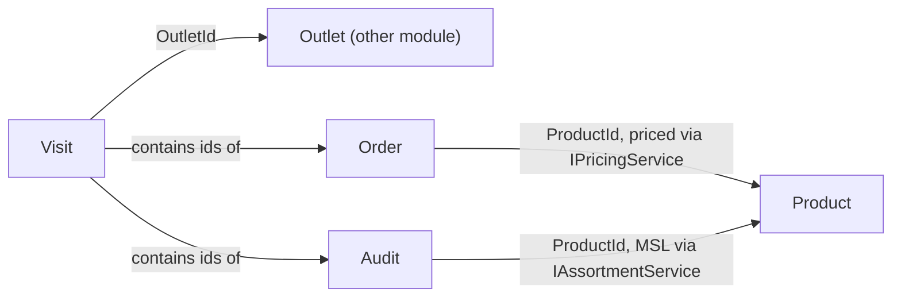

# Domain Model

> **Status:** ✅ Baseline · **Last updated:** 2026-08
> **Feeds:** EF Core mapping ([data & persistence](14-data-and-persistence.md)), [module boundaries](10-module-boundaries.md)

This document names the **aggregates**, their key **invariants**, and the **shared kernel** — the
tactical DDD layer that sits under the [functional specs](../product/00-product-overview.md). It
is deliberately about *boundaries and rules*, not exhaustive field lists (those live with the EF
mappings). An **aggregate** is a consistency boundary: it is loaded, changed, and saved as a unit,
and it protects its invariants.

## 1. SharedKernel (dependency-free)

Value objects and primitives every module may use; no domain logic of a specific module.

| Type | Notes |
|---|---|
| `Money(amount: decimal, currency: Iso4217)` | No implicit cross-currency math ([ADR-0010](adr/0010-internationalization.md)) |
| `GeoPoint(lat, lng)` + `Geofence(center, radiusM)` | Outlet location & check-in validation |
| `TenantId`, and strongly-typed ids (`OutletId`, `ProductId`, `VisitId`, …) | Prevent id-mixups across modules |
| `Result` / `Result<T>` | Explicit success/failure without exceptions for expected errors |
| `IClock` | The only time source; UTC ([AT-7](10-module-boundaries.md#5-enforcement--architecture-tests)) |
| `CustomFields` (typed JSONB wrapper) | Config-driven fields ([ADR-0009](adr/0009-config-driven-customization.md)) |

## 2. Aggregates by module

| Module | Aggregate root | Contains | Owns invariants like |
|---|---|---|---|
| IAM | `User` | roles, permission set, active-device ptr, locale/tz | ≥1 role; last-role-removal disables ([BR-IAM-3](../product/10-identity-and-access.md#5-business-rules)) |
| IAM | `Role` | permissions | tenant-scoped |
| Organization | `OrgUnit` | position assignments | management line acyclic |
| Organization | `Territory` | outlet membership, rep assignment | one active rep at a time ([BR-ORG-2](../product/11-organization-and-territory.md#5-business-rules)) |
| Outlets | `Outlet` | contacts, classification, geofence, custom fields | has channel + primary territory; geo required if journeyed ([BR-OUT-1/2](../product/12-outlets-master-data.md#5-business-rules)) |
| Products | `Product` | UoM/pack, tax class, custom fields | — |
| Products | `PriceList` | prices (per product) | single currency ([BR-PRD-1](../product/13-products-and-pricing.md#5-business-rules)) |
| Products | `Assortment` | items, MSL flags | per channel + outlet overrides |
| Products | `Promotion` | type, scope, window, priority | valid only in window |
| Configuration | `FieldDefinitionSet` | custom-field defs per entity | validates JSONB values ([ADR-0009](adr/0009-config-driven-customization.md)) |
| Configuration | `VisitWorkflow` / `SurveyForm` / `ScoreWeights` | ordered steps / questions / weights | weights sum to 100% ([BR-AUD-4](../product/22-merchandising-and-audits.md#5-business-rules)); snapshot-versioned |
| Journey | `JourneyPlan` | scheduled visits | respects capacity ([BR-JRN-3](../product/20-journey-planning.md#5-business-rules)) |
| Visit | `Visit` | steps, geo-stamp, outcome, **child ids** for audit/order | sealed after checkout; mandatory steps done ([BR-VIS-3/4](../product/21-visit-execution.md#5-business-rules)) |
| Audit | `Audit` | availability, facings, price checks, survey answers, photo refs, score | belongs to a visit; sealed with it ([BR-AUD-6](../product/22-merchandising-and-audits.md#5-business-rules)) |
| Order | `Order` | order lines, applied promos, totals, status | locked after submit **except a server-rejected order re-opens editable** ([BR-ORD-4/9](../product/23-order-capture.md#5-business-rules)); no cross-currency lines |
| Sync | `Device` | watermarks, active flag | one active device for pull/bind; may drain-push when deactivated ([A8](../product/decisions-and-assumptions.md#a8--device--sync-behavior-one-active-device-auto-background-sync), [sync engine §7](12-offline-sync-engine.md#7-device-lifecycle)) |

## 3. Aggregate boundaries & cross-references

Aggregates reference each other **by id, never by object graph** — the same rule as
[schema-per-module](adr/0005-postgres-schema-per-module.md) at the code level:

- A `Visit` does **not** hold an `Outlet` object — it holds an `OutletId` and resolves details via
  `IOutletCatalog` when needed.
- `Order`/`Audit` are **separate aggregates** referenced by the `Visit` via ids, not nested — they
  have independent lifecycles on the device and their own invariants.
- Cross-module facts propagate via **integration events** ([ADR-0006](adr/0006-in-process-messaging-and-outbox.md)),
  never by reaching into another aggregate.

## 4. Invariants that the whole system leans on

A handful of invariants are load-bearing for the [sync engine](12-offline-sync-engine.md) and are
therefore stated explicitly and guarded (domain + [architecture tests](17-testing-strategy.md)):

1. **`Visit` seals on checkout; `Order` locks on submit; `Audit` seals with its visit.** → the
   "no co-edited record" property that makes conflicts impossible ([ADR-0007](adr/0007-offline-sync-strategy.md)).
2. **Every tenant-owned aggregate carries `TenantId`.** → isolation ([ADR-0008](adr/0008-authentication-and-multitenancy.md)).
3. **Pricing is a pure function of `(outlet, product, qty, date, snapshot)`.** → identical result
   on device and server ([BR-PRD-7](../product/13-products-and-pricing.md#5-business-rules)).
4. **All money is `Money`; all time is UTC via `IClock`.** → i18n correctness ([ADR-0010](adr/0010-internationalization.md)).

## 5. Domain events (internal) vs integration events (published)

- **Domain events** fire *within* an aggregate/module (e.g. `OrderSubmitted` raised by the `Order`
  aggregate) to keep the aggregate clean and drive side effects locally.
- A subset are promoted to **integration events** in the module's `Contracts` and published via
  the [outbox](adr/0006-in-process-messaging-and-outbox.md) for other modules — the registry is in
  [module boundaries §7](10-module-boundaries.md#7-module-registry).
