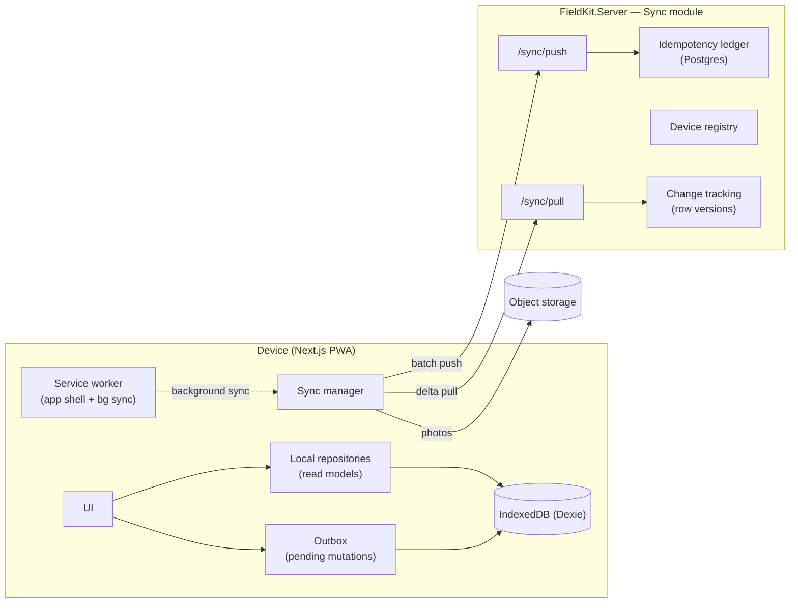
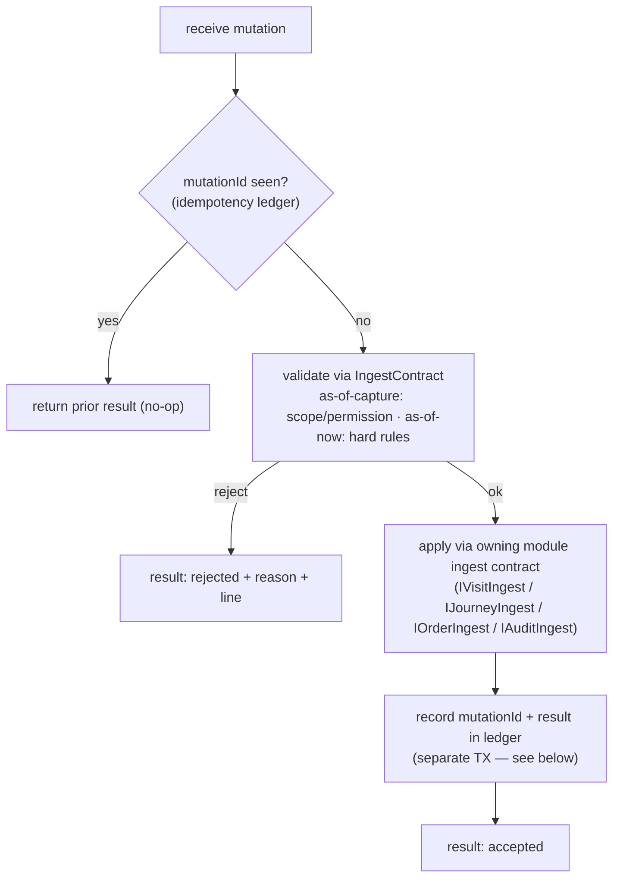

# Offline Sync Engine

> **Status:** ✅ Baseline · **Showcase:** offline-first sync · **Last updated:** 2026-08
> **Decision:** [ADR-0007](adr/0007-offline-sync-strategy.md) · **Functional view:** [offline behavior](../product/30-offline-behavior.md)

This is the hard part, specified. [ADR-0007](adr/0007-offline-sync-strategy.md) chose the
*strategy* (snapshot pull + idempotent outbox push, conflicts designed out); this document is the
*engineering*: the client store, the wire protocol, versioning and watermarks, idempotency,
failure handling, and the server-side machinery.

## 1. Components



- **Local repositories** — typed read models over IndexedDB (outlets, products, prices,
  journeys, templates) the UI reads from; populated by pull.
- **Outbox** — durable queue of pending mutations, each with a client mutation id and status.
- **Sync manager** — orchestrates pull/push/photo upload; triggered on reconnect, background
  sync, or manual.
- **Server Sync module** — exposes `/sync/pull` and `/sync/push`, owns change tracking, the
  device registry, and the idempotency ledger.

## 2. Client storage model (IndexedDB / Dexie)

| Store | Kind | Contents |
|---|---|---|
| `ref_*` (built: `ref_outlets`, `ref_planned_visits`, `ref_visit_workflows`, `ref_products`, `ref_assortment`, `ref_assortment_overrides`, `ref_price_lists`, `ref_price_lines`, `ref_price_assignments`, `ref_promotions`, `ref_promotion_assignments`, `ref_surveys`, `ref_score_weights`, `ref_tax_rates`) | Reference (read-only) | Rep-scoped snapshot; server-authoritative. What each is scoped *by* differs — see §3 |
| `visits` | **Device-authored** | A visit as the rep works it (W9 slice 4). The one store here that is neither a copy of the server's data nor a write-once payload — see below |
| `outbox` | Mutations | `{ mutationId, type, payload, status, createdAt, attempts, error? }` |
| `blobs` | Binaries | Downscaled photos awaiting upload, keyed by mutation + slot |
| `watermarks` | Sync state | How far the device has been told about one entity |
| `meta` | Sync state | Device id, last sync, snapshot version |

Writes to `outbox`/`blobs` are **synchronous and durable before the UI confirms** — the "no lost
work" guarantee ([OFF-02](../product/30-offline-behavior.md#6-requirements)). Outbox status:
`pending → inflight → failed`, with an accepted mutation **deleted** rather than given a fourth
state.

**`visits` is the first store the device authors** (W9 slice 4,
[`lib/visits/local-visit.ts`](../../frontend/lib/visits/local-visit.ts)), and it changes what "no
lost work" has to mean here. Every `ref_*` table is recoverable — lose it, and the next pull rebuilds
it. The outbox is written once and thereafter only marked. A visit is neither: it is created at
check-in, mutated repeatedly as the rep works the steps, and only becomes an outbox mutation when it
is sealed. Three consequences:

- **Check-out seals the visit and queues the mutation in one transaction.** Two writes leave a window
  where the visit reads as finished and nothing will ever send it — a lost day in the one place a rep
  would never think to look, because their phone says it is done. IndexedDB gives real cross-store
  transactions, so the window is avoidable and is avoided.
- **Completing a step is a transaction too**, because it is a read-modify-write of a row a second tap
  can race: two completions from separate reads each rewrite the whole `steps` array, and the later
  write silently undoes the earlier.
- **The visit is not deleted once queued.** It is the rep's own record of their day, and the sync
  badge on it reads the *outbox* by subject id — a `sent` flag on the visit would be a second copy of
  an answer the outbox already holds.

The device also re-runs the server's rules — the geofence (`VIS-01`), mandatory-step gating
(`BR-VIS-3`), the reason a non-productive visit owes (`VIS-05`) — because offline there is nobody
else to run them. The server still checks; a device is not a trust boundary. But a rep told at
reconnect that their check-out was invalid has been told far too late to walk back into the shop.

**Three things the implementation (W8 slice 6, [`lib/sync`](../../frontend/lib/sync)) settled that
this table used to leave open:**

- **One database per tenant *and* signed-in subject**, named `fieldkit:<tenant>:<subject>`. A rep
  signing in on a colleague's tablet gets an empty store rather than the colleague's territory.
  Server-side, tenant isolation is a query filter nobody can bypass; the client equivalent is that
  the data was never in the same database to begin with, rather than a column application code has
  to remember to filter on. It also makes sign-out total: delete the database.
- **There is no `acked` status.** A row whose only content is "this finished" is a table that grows
  for the life of the install with nothing reading it. The record of the work is the visit, which
  the device already holds and the server now agrees about. What survives is the two states somebody
  still has a question about: `pending`, which retries, and `failed`, which needs a person.
- **`watermarks` is its own store, not rows in `meta`.** It is written in the *same transaction* as
  the rows it describes, and that is easier to get right — and to read — against a typed store than
  against a stringly-typed blob.

**`inflight` is durable, and reclaimed on startup.** A device killed mid-push — tab closed, battery
flat, OS reclaiming memory — leaves rows claiming to be in flight on a connection that no longer
exists, and nothing will ever answer them. Startup returns them to `pending`. Re-sending is safe
precisely because the mutation id survived the crash: whatever the server did with the first
attempt, the ledger will say so (§4).

**Schema versions are declared forever, and the outbox is why (`OFF-13`, W8 slice 11).** Dexie
replays versions in order to bring an existing database forward, so deleting an old one does not
simplify the file — it strands every device that has not opened the app since, which on a field app
is the ones that most need to sync.

Every `ref_*` table is a copy of something the server still has: lose it and the next sync rebuilds
it. **The outbox is the only store the device cannot re-fetch**, so it is the one a migration must
not touch. [`migration.test.ts`](../../frontend/lib/sync/migration.test.ts) opens a version-1
database holding unsent work with the version-2 code and checks the work is still there, still
ordered, still carrying its refusal reasons — and still sendable, which a "rows preserved" assertion
cannot reach on its own.

Version 2 itself is a compound `[status+createdAt]` index on the outbox. `pending()` used to load
every pending row and sort it in JavaScript, at the top of every push, on the device with the least
CPU — and it got slower exactly as a rep’s offline day got longer. There is deliberately **no
`upgrade()` callback**: Dexie builds a new index by walking the rows, nothing about them changes, and
an empty upgrade block is a hook somebody later fills in by accident.

**Version 3 changes no schema at all, and that is the interesting part.** `OutletSnapshot` gained
`code` — the tenant's own identifier for a shop, which the device had been doing without — so every
outlet row already on a device is stale in a way the delta cannot repair: the pull only carries
outlets whose row version moved, so an unedited shop keeps its codeless row until somebody in the
back office happens to touch it. Indefinitely, and differently per device.

So the migration is one line — delete the `outlets` watermark — and the next pull re-baselines from
cursor 0. Three things about it are the pattern for the next time a snapshot grows a field:

- **A wire change can need a store version even when the store's shape is unchanged.** Dexie versions
  index *schemas*; what went stale here is *content*, one layer up.
- **Only that entity's watermark.** Clearing all of them would re-download the catalogue, the prices
  and the promotions to fix a field on one entity — the exact cost the per-entity cursors in §3 exist
  to avoid.
- **The rows are left in place, not deleted.** A device that goes offline between the update and the
  next successful pull keeps a territory it can still work — a name and no code, which is what it had
  yesterday — where an emptied store would give a rep an app with no shops in it and no way back
  until they found signal. It is self-healing either way: if the pull never lands, the watermark is
  still 0 and the next one tries again.

**Version 4 is version 3 again, for `radiusMetres`** (W9 slice 2) — and the duplication is the
lesson rather than a smell. Dexie does **not** replay a version a database has already seen, so
editing version 3 to cover the new field would leave every device already on 3 holding outlets
without it, forever. A second identical upgrade costs a device that jumps 2 → 4 one redundant
`delete`, and is the only thing that reaches a device sitting on 3.

Why that field is worth a re-baseline when a stale outlet is usually harmless: the device assesses
the geofence and `IVisitIngest` stores its verdict **unmodified**, so an outlet row with no radius
produces a check-in classified against `undefined` that nothing downstream ever re-checks. **A
re-baseline is cheap; a wrong answer a rep cannot see is not.**

**Version 5 adds the `visits` store and has no `upgrade()`** (W9 slice 4) — the first *table* added
since v1. There is nothing to transform, because there were no visits before it; Dexie creates the
table and an existing device carries on with its outbox and its reference data untouched, which is
`OFF-13`'s promise for a rep who updates the app mid-day with work still queued.

**Versions 6, 7, 9 and 11 add stores and nothing else** — surveys and score weights (W10 slice 7),
the device's own `orders` (W11 slice 6), `ref_tax_rates` (W11 slice 7b) and `ref_order_minimums`
(W11 slice 8b-ii). Same argument as version 5: there is nothing to transform, and an empty
`upgrade()` is a hook somebody later fills in by accident.

Version 11 is also the first store that needs **no server backfill**, and for a reason worth naming:
`OrderMinimum` was born sync-tracked one slice earlier, so there are no pre-existing rows sitting at
row version zero for the feed to miss. Every other reference entity had to be backfilled because it
existed before ADR-0013 did.

**Version 8 re-baselines for a different reason than 3 and 4 did** (W11 slice 7a): those dropped a
watermark because a field was *added*, this one because the rows were the wrong **type** — prices and
promotion decimals had been crossing as JSON numbers, so every amount on the device had already been
through IEEE-754 before `decimal.js` saw it. A delta would have corrected only the ones somebody
edited afterwards.

**Version 10 is version 3 for the third time** (W11 slice 7c), for `countryCode` on the outlet — and
by now the shape argues for itself. A snapshot grew a field, so the rows already on a device are thin
rather than wrong; the delta cannot repair them, because it carries only outlets whose row version
moved; one watermark is dropped and the rows are left in place. The three bullets above are still the
whole of it.

**The blob store is not built yet**, deliberately — photo upload is `OFF-08`/W11, and a store with
no writer is a schema version spent on nothing.

**Durability is bounded by the platform, and we say so.** Browsers — iOS Safari especially — can
**evict** IndexedDB/service-worker storage under pressure or inactivity policies. FieldKit therefore
(1) requires **add-to-home-screen install** for field use (installed PWAs get stronger persistence),
(2) requests **`navigator.storage.persist()`** on first bind and surfaces the result, and (3) treats
a **large or aged unsynced outbox as an at-risk condition** — prompting/forcing a sync and warning
the rep. The durability guarantee is honestly scoped to *"durable within the OS's storage
guarantees, install required"* — not an absolute claim the platform can't keep. This is why the
sync-early triggers (reconnect, background, "Sync now") matter: the shorter the unsynced window, the
smaller the eviction exposure.

## 3. Pull protocol (reference delta)

**Request** carries the device's current watermarks:

```jsonc
POST /sync/pull
{
  "deviceId": "…",
  "cursors": { "outlets": 4192, "products": 8801, "prices": 8790, "journeys": 51120 }
}
```

**Server** returns, per entity type, rows with `rowVersion > cursor`, **filtered to the device's
territory scope** ([A4](../product/decisions-and-assumptions.md#a4--offline-data-scope-territory-scoped)),
plus the new high-water mark and any **tombstones** (deletes/out-of-scope):

> **Every decimal on this protocol is a `string`.** A price, a discount percentage, a fixed amount
> off, a perfect-store weight — none of them cross as JSON numbers, because `JSON.parse` turns a bare
> `4.50` into an IEEE-754 float *before* the device's `decimal.js` engine is handed it. That defeats
> the exactness `BR-PRD-8` and `BR-ORD-2` are about: the rep's total and the server's recomputation
> are supposed to agree to the cent, and a price that arrived as a float has already lost the
> argument.
>
> **Prices and promotions shipped as numbers and nobody noticed for five weeks** (W6 → W11 slice 7a).
> The parity vectors could not catch it — they feed the engine strings from a file and never touch a
> pull feed — and the write side was already correct, so the inconsistency lived inside one module.
> `ScoreWeightSnapshot.Percentage` had the rule right from the start; it simply was not applied to
> the two feeds that carry money.
>
> Format is invariant-culture `0.00##`: at least two places because money has them, up to four
> because a unit price legitimately carries them and rounding happens at the line.
> **Counts stay numbers** — a tier's `minQuantity` is genuinely an integer.

```jsonc
{
  "changes": {
    "prices":  { "upserts": [ /* … */ ], "tombstones": [ 8791 ], "cursor": 8830 }
  },
  "snapshotVersion": "2026-08-01T09:12:00Z#8830"
}
```

- **Row version** = a per-tenant monotonic counter stamped on every change, and the single ordering
  primitive. **Not a Postgres sequence** — `nextval()` allocates before commit and never rolls back,
  so a device can bank a cursor past a version still uncommitted and never see that row again
  ([ADR-0013](adr/0013-sync-row-version.md)).
- The client applies upserts/tombstones to `ref_*` and advances the watermark **atomically** per
  entity type, in one IndexedDB transaction (`applyOutletChanges`, W8 slice 6). Written separately,
  either order loses: **cursor first** and a crash advances the device past changes it never stored,
  which are then gone until something unrelated edits them; **rows first** is merely wasteful, and
  only safe because upserts happen to be idempotent. A partial pull is safe — the next one resumes
  from the last committed cursor.
- **Territory changes** (rep reassigned, outlet moved) arrive as tombstones for now-out-of-scope
  rows + upserts for newly-in-scope rows.

**Each entity type scopes by something different, and that is the whole content of adding one.**
The paging, cursor and tombstone machinery is identical every time; what has to be decided is *whose
row is it*, and the answer changes what the feed's interface has to look like:

| Entity | Scoped by | Needs a baseline? |
|---|---|---|
| `outlets` | The rep's **territory**, as of today ([`IReferenceChangeFeed`](../../FieldKit.Modules.Outlets.Contracts/IReferenceChangeFeed.cs)) | **Yes** |
| `journeys` | The rep named on the **plan** ([`IJourneyChangeFeed`](../../FieldKit.Modules.Journey.Contracts/IJourneyChangeFeed.cs)) | No |
| `configuration` | **Nothing** — every device gets every visit workflow ([`IVisitWorkflowFeed`](../../FieldKit.Modules.Configuration.Contracts/IVisitWorkflowFeed.cs)) | No |
| `products` | **Nothing** — every device gets the whole catalogue ([`IProductChangeFeed`](../../FieldKit.Modules.Products.Contracts/IProductChangeFeed.cs)) | No |
| `assortment` | **Nothing** — the channel list ([`IAssortmentChangeFeed`](../../FieldKit.Modules.Products.Contracts/IAssortmentChangeFeed.cs)) | No |
| `outletAssortment` | The device’s **outlet set** — the per-outlet overrides | **Yes** |
| `priceLists`, `priceLines` | **Nothing** ([`IPriceChangeFeed`](../../FieldKit.Modules.Products.Contracts/IPriceChangeFeed.cs)) — see the limitation below | No |
| `priceAssignments` | Channel rows by nothing; outlet rows by the device’s **outlet set** | **Yes** |
| `promotions` | **Nothing** — each travels whole, targets and tiers inside ([`IPromotionChangeFeed`](../../FieldKit.Modules.Products.Contracts/IPromotionChangeFeed.cs)) | No |
| `promotionAssignments` | Channel rows by nothing; outlet rows by the device’s **outlet set** | **Yes** |
| `surveys` | **Nothing** — every device gets every questionnaire ([`ISurveyFormFeed`](../../FieldKit.Modules.Configuration.Contracts/ISurveyFormFeed.cs)) | No |
| `scoreWeights` | **Nothing** — and **every published version**, not just the newest, because an audit records the one it was scored against (`BR-AUD-8`) | No |
| `taxRates` | **Nothing** — a rate is a fact about a country and a class, not about a shop ([`ITaxRateChangeFeed`](../../FieldKit.Modules.Products.Contracts/ITaxRateChangeFeed.cs)) | No |

A **baseline** call — "hand me these rows whatever their version" — exists because an outlet can
enter a rep's territory *without being edited*, carrying a row version far below the device's cursor,
so a pure delta would never mention it. That is a property of membership being a separate fact from
the row.

A planned call has no such gap: it is **born** belonging to one rep, because the plan names them, and
never changes hands. Membership therefore only ever changes by the row being created, and creation
stamps a version above every cursor by construction. Journey's feed is one method, and the missing
second one is a statement rather than an omission.

The same question decides the **tombstones**. Outlets need scope tombstones minted by Sync, because a
shop leaving a territory is not a delete and Outlets has nothing to report. Journey sends none at
all: nothing deletes a planned call (`BR-JRN-2` — a missed call becomes `NotVisited`, which is an
update), and a tombstone could not be attributed to a rep even if one existed, since the row that
said whose it was is the row that is gone.

**Scoping to nothing is a real answer, and for configuration it is the right one.** Visit workflows
*could* be narrowed to the channels of the rep's outlets. That was rejected on both of its costs: it
would reintroduce the membership problem the outlet baseline exists to work around — moving one shop
to another channel puts a workflow in scope *without editing it*, so a pure delta would never send
it — and it would do so to save a payload of a handful of rows a tenant's own administrators wrote.
There is nothing in a workflow that one rep may see and another may not. **The cheapest correct scope
is sometimes no scope**, and a narrowing that buys nothing costs a whole class of bug.

**A promotion travels whole, and the stake is higher than a workflow’s.** Its targets and tiers are
inside the row: a device holding four of five tiers does not fail, it computes a **different
discount**, and neither the rep nor the shop has any way to notice. That put the row version on the
root — which exposed a real bug, because the endpoints that set targets and tiers wrote those tables
and never touched the promotion. They do now (`Promotion.Touch`), on the grounds that the aggregate
did change.

**Expired promotions are held, not filtered.** `BR-PRD-4` resolves against the *order’s* date, so a
device pricing an order dated last Tuesday needs the promotion that was running last Tuesday.
Filtering server-side would make an offline device compute a different total from the server for the
same order — the disagreement the parity suite exists to prevent, arriving through the sync layer
instead.

**Tax rates were the last pricing input that never travelled** (W11 slice 7b). The device has had a
tax engine since W7 slice 14 and the server has had rates since W6 slice 13; nothing carried one to
the other, and `TaxRate` was not even `ISyncTracked`, so there was no delta to send. The failure was
quiet rather than loud: `priceLine` reads a missing rate as *unknown* and charges nothing, so a rep
saw a plausible net total that the server's recomputation exceeds by exactly the tax, on every order.
Expired rates are held for the same reason expired promotions are — `BR-PRD-6` resolves against the
*order's* date, and VAT changes on announced dates.

**The outlet says which country taxes it** (W11 slice 7c), which is what made the rates usable. A
rate is matched to a jurisdiction, and until this the device held `ref_tax_rates` and had no way to
name the country of the shop the rep was standing in. It is the *shop's* country, not the rep's and
not the tenant's: a tenant selling across a border has reps who cross it, and a device reading one
country from configuration would charge Romanian VAT in Sofia — a wrong number that looks completely
ordinary on the screen. `taxPercentageFor` is the only reader, and the join is
outlet → country → `[countryCode+taxClassId]` → `resolveTaxRate`.

> **Null means *unknown*, in three places, deliberately alike.** The shop has no country (its address
> was never completed — an address is optional under `OUT-01`), the product has no tax class, or
> nobody authored a rate for the pair. `priceLine` charges nothing for a null, which is the same total
> a genuine `"0.00"` rate produces — and that collapse is safe only because the caller keeps the
> distinction: 0% is a tenant describing zero-rated goods, null is a tenant who has not finished
> setting up. The server draws the same line in `TaxEndpoints`.

**Prices are the one place a device holds data outside its territory, and it is recorded as a
limitation rather than defended.** Lists and lines go to every device, so a rep’s phone holds price
lists for regions and channels they never visit. The narrowing — to the lists assigned to this rep’s
outlets and their channels — needs a per-device record of which lists were sent, because a list
enters scope when an *assignment* changes rather than when the list does, and a pure delta would
never mention it. That is a second scope-set table and a baseline, for the first entity where the
leak is commercial rather than personal. What is on the device is tenant-internal, a rep can already
read the price of everything they sell, and prices are not personal data — but if a tenant objects,
[`IPriceChangeFeed`](../../FieldKit.Modules.Products.Contracts/IPriceChangeFeed.cs) records what to
build.

**An empty outlet set is not always an empty answer.** For assortment overrides it is: a rep with no
territory has no shop-level exceptions. For price *assignments* it is not — the channel policy still
has to reach them, because the shops they are given tomorrow are priced by it. Same scope parameter,
opposite meaning, decided by what the entity is for.

**One rule, two scopes, two cursors.** The assortment is the first thing the protocol carries whose
two halves do not agree about who owns them: the channel list is a tenant's process and goes
everywhere, while an outlet's overrides are exactly as private as the outlet. So they are separate
entity types with separate watermarks, and the overrides are the **first entity scoped by the
device's outlet set** — reusing the `entering`/`retained`/`leaving` diff outlets have needed since
slice 3, and needing a baseline for the same reason: an outlet joining a rep's territory brings
overrides written long ago, whose row versions sit far below the device's cursor.

**An outlet leaving scope needs no override tombstones, and that is a consequence rather than a
gap.** The device is already told the outlet is gone, and an override is meaningless without the
outlet it qualifies — so the device prunes them itself from a fact it already holds. Minting a second
set of tombstones would mean the server enumerating rows it is about to stop being allowed to talk
about.

**The effective assortment is computed on the device, never sent resolved.** `PRD-02` stores
overrides precisely so there is no materialised per-outlet list to keep in step; sending one would
rebuild that materialisation on the wire, and a single channel edit would then have to invalidate
every outlet it touches.

**The catalogue is unscoped for a second reason of its own, and it is the stronger one.** A rep
standing in a shop has to be able to **name what they are looking at** — on an unplanned call, at a
shop whose assortment changed this morning, or when a facing turns out to be one of ours after all. A
catalogue narrowed to the assortment gives a blank where a name should be, and that failure looks
like missing data rather than like a decision somebody made.

Holding a product is **not** permission to sell it. What a rep may order at a given shop is the
assortment's question (`PRD-02`), answered on the device from its own entity; the catalogue answers
only "what is this". Conflating the two is what makes the narrowing look attractive in the first
place.

**Discontinued rows are sent, not filtered.** A device holding an order taken last week still has to
name what is on it. Filtering server-side would make the row vanish on the next pull with no
tombstone and no explanation, and the screen would show an id. `status` travels with the row so the
device can decide what to *offer* — the client's `products()` reader returns active rows only, while
`product(id)` will still find a discontinued one.

**A workflow's steps travel inside it, not as a fourth entity type.** A workflow is only ever useful
whole: a device holding four of five steps would run a visit that silently asks for less than the
tenant configured, and `BR-VIS-3` would gate check-out on a mandatory step it never received. Sending
the aggregate as one row makes a partial workflow unrepresentable rather than merely unlikely — and
the row version therefore lives on the workflow, not the step. That is safe because every edit goes
through `VisitWorkflow.Set`, which writes `ModifiedAtUtc` and so marks the root modified whatever the
steps did.

**Enums cross the wire by name.** Serialised, an enum is an *ordinal*: inserting a value into the
middle of `VisitStepType` would silently reinterpret every workflow already stored on every device,
and the device would open the wrong sub-flow with no error anywhere. The name is the stable thing, so
the name is what travels — the same rule `PlannedVisitSnapshot`'s status and source follow.

**Journeys are pruned on the device, by date, and are not windowed on the server.** A server-side
date window would make the passage of midnight a membership change with no row version behind it —
the same gap the outlet baseline exists to paper over — for a rule a phone evaluates perfectly well
against a date it already holds. Nothing has to be told; time passes on the device too.
- **Scope *entry* needs more than `rowVersion > cursor`.** An entity that moves **into** the
  device's scope may have an *old* row version (below the current cursor), so a pure delta would
  never send it. So Sync tracks the device's **scope set** and, on each pull, diffs it against the
  current scope (resolved via `IRepScope` + `RepAssignmentChanged`/outlet-move events). Entities
  **entering scope** are requested from the change feed as a **full baseline for those specific ids**
  (`rowVersion ≥ 0`, filtered to the entering ids) — *in addition to* the normal
  `rowVersion > cursor` delta for already-in-scope rows. Entities **leaving scope** are tombstoned.
  So `IReferenceChangeFeed` takes `(cursor, scopeDelta)`, and **row version orders content changes
  while the scope diff drives membership** — closing the "newly-in-scope is invisible" hole without
  re-stamping row versions across schemas Sync doesn't own.
- **Snapshot coherence.** Because watermarks advance per entity type, the local store between pulls
  is a *patchwork* (e.g. products@8801, prices@8830), not a uniform point-in-time. This is
  intentional and safe: on-device capture tolerates cross-entity skew because **each order line
  records its own resolved price at capture** (BR-ORD-6) rather than trusting a global "as-of X."
  The `snapshotVersion` a mutation carries is the **high-water mark across the entity types it
  read** — enough for the server to re-price and *flag* drift, not a claim that the whole store was
  uniformly at X.
- **Config coherence exception.** Cross-*referencing* config (a visit-workflow step points at a
  survey-form; a workflow references a weight-set) must not tear. The **Configuration** module ships
  these as a **single versioned bundle** (`ConfigurationSet@version`) applied atomically on the
  device — a partial pull never leaves a workflow step pointing at a not-yet-pulled form. Config is
  the one place we trade patchwork tolerance for bundle atomicity, because its internal references
  would otherwise dangle at render time.

## 4. Push protocol (device-owned mutations)

> ### Fixed in W11 slice 8c — an order submitted mid-visit used to be lost, silently
>
> Kept rather than deleted, because the *shape* of it is the lesson: three individually correct rules
> combined into data loss, and no suite could see the combination.
>
> **What now happens.** The drain holds a `CapturedOrder` back until the visit it names has reached
> the server — checked out, and its own mutation gone from the outbox. A held order does not block
> the batch, so the visit that releases it goes in the same run. And a refused mutation is counted:
> the indicator reads **"needs attention"** instead of "Everything synced", ranked above offline
> because it needs a person rather than a connection (`OFF-09`).
>
> Reproduced in a browser against a real server, end to end. Three separate rules combined into data
> loss:
>
> 1. **The order is enqueued before the visit it belongs to.** A rep submits the order at the counter
>    and checks out afterwards, and `CapturedVisit` is only enqueued *at check-out* — so the order's
>    outbox row is genuinely older, and any drain order sends it first.
> 2. **The server refuses it.** `OrderIngestService` rejects an order whose visit it has never seen:
>    `order.ingest.visitUnknown`. That check is correct — an order has to belong to a call this rep
>    made.
> 3. **The refusal is terminal, and invisible.** `markRejected` writes `status: "failed"`, nothing
>    retries a failed row, and `pendingCount` counts only `"pending"` — so the shell reads
>    **"Everything synced"** with a dead order in the outbox.
>
> The visit syncs a moment later and is accepted. The order never is. Nobody is told.
>
> **Why no test caught it.** Every device test mocks `@/lib/api/sync`, so nothing exercises the real
> refusal; every server test pushes a visit before an order, because a test that wanted an order to
> succeed had to. The seam is the *ordering between two mutations*, which neither suite has a place
> to express — the same two-suites-one-seam shape as the `/sync/push` property-name bug in W9 and the
> float prices in W11 slice 7a.
>
> **Two of the four candidate rules gave.** The drain now holds the order — chosen over making the
> order refuse to seal before check-out, because that would change what *submitted* means to a rep
> standing at a counter, and over distinguishing retryable refusals, which needs the server to say
> which is which. The indicator was fixed regardless: calling refused work "synced" is wrong whatever
> the ordering does.
>
> **Held, not reordered.** The server does apply a batch in array order, so sending the visit first
> within one batch would also work — and would put the rule in two places and make it a property of
> the wire rather than of the device. One function, on the device, where a test can reach it.

> ### Finished in W11 slice 8d — the hold was right, and it released into a second refusal
>
> **8c fixed the ordering and not the outcome.** Held until the visit had been accepted, the order
> then arrived at a visit the server had already sealed — because a pushed `CapturedVisit` is created
> **already checked out** (`Visit.Ingest`: "sealed on arrival") and a device only enqueues one *at*
> check-out. Both `OrderIngestService` and `AuditIngestService` refused a sealed visit, so
> offline-captured work had no window at all: `UnknownVisit` before the visit landed, and
> sealed-refused after it. *Every* offline order, since W11 slice 1.
>
> **Found in a browser again**, while verifying slice 9a's audit screen — and reproduced with an
> order rather than inferred from the audit: check in, take the order, check out, sync, and the
> outbox holds `order.ingest.visitUnknown` beside `audit.ingest.visitSealed`.
>
> **Why no test caught this one either.** The two that covered it — `A_sealed_visit_refuses_a_new_order`
> and its audit twin — asserted the refusal while sending a capture time *before* the check-out. They
> were describing the ordinary offline round and calling it the abuse case, and they passed because
> the rule tested a flag rather than a moment.
>
> **The rule was always about `capturedAtUtc`.** "Work attached to a visit already filed as done"
> means work *taken* after the seal, so that is what is compared, through
> `VisitFacts.WasOpenAt(moment)` — a fact both modules ask and each acts on its own way, which is the
> split `IVisitContext` already drew. Both timestamps come from the same device's clock, so the
> comparison holds on a phone that is wrong about the time; and the boundary is **inclusive**, because
> an order sealed as the rep walks out is the ordinary end of a call.
>
> **The drain gate stays.** It is still right that work should not be sent before the visit it names —
> and 9a extended it to `CapturedAudit`, which had the identical dependency.

**Request** is a batch of the rep's captured work:

```jsonc
POST /sync/push
{
  "deviceId": "…",
  "mutations": [
    { "mutationId": "c1a…", "type": "CapturedVisit",  "visit":       { /* … */ } },
    { "mutationId": "e7b…", "type": "NotVisitedCall", "notVisited":  { /* … */ } },
    { "mutationId": "f2c…", "type": "RescheduledCall","rescheduled": { /* … */ } },
    { "mutationId": "a9d…", "type": "UnplannedCall",  "unplanned":   { /* … */ } },
    { "mutationId": "d4f…", "type": "CapturedOrder",  "order":       { /* … */ } }
  ]
}
```

**`type` is a discriminator, and became one in W9 slice 9.** With `CapturedVisit` as the only legal
value it was a guard against nonsense; the three journey annotations made it the routing, and each
arm knows only which module contract to call.

> **An audit is its own kind, not a property of `CapturedVisit`** (decided in W10 slice 0, built in
> W10 slice 6 — [audits §5](../product/22-merchandising-and-audits.md#the-three-the-score-cannot-be-given-later-w10-slice-0)).
> `BR-AUD-6` seals an audit with its visit, which reads like one payload; the device honours that by
> queueing both in one transaction, and the outbox's oldest-first drain lands the visit first. What
> decides it is refusal: this endpoint answers **per mutation** so a batch of twenty does not fail
> over one bad outlet id, and a combined payload would let an audit refused on its merits reject a
> completed visit. Sync still holds no opinion about what makes a visit
valid or a round annotatable — applying through the owning module is what keeps that true.

**A typed property per kind, not a `payload` blob.** Each mutation type adds its own optional
property, which is additive — a device that only knows `visit` keeps working when `order` lands — and
keeps the request describable in OpenAPI, which an opaque blob would not. `snapshotVersion` is not
accepted yet: nothing reads it until as-of-capture validation exists (see below), and a field the
server ignores is a promise it is not keeping.

**Server processing**, per mutation:



**Response** is a per-mutation result set — partial success is normal:

```jsonc
{
  "results": [
    { "mutationId": "c1a…", "status": "accepted" },
    { "mutationId": "d4f…", "status": "rejected",
      "reason": "visit.ingest.outletUnknown",
      "detail": "That outlet does not exist for this tenant." }
  ]
}
```

- **Idempotency:** `mutationId` is checked in a ledger (a Postgres table, unique on tenant +
  device + mutation id; no cache — [ADR-0007 amendment](adr/0007-offline-sync-strategy.md#amendment-2026-08-the-ledger-is-postgres-and-there-is-no-redis)). A
  redelivered mutation returns its **prior recorded result** and applies nothing — exactly-once
  *effect* over at-least-once *delivery*. The ledger is **retained at least as long as the maximum
  offline + retry window** (a very late retry must still dedupe); entries older than that horizon are
  pruned. `mutationId` dedupes *transport* re-delivery, not a client that mints two ids for one
  intent — if accidental double-capture matters, the field module adds a business key.
- **Apply through the ingest contract, not tables:** Sync calls `IVisitIngest`/`IOrderIngest`/
  `IAuditIngest` so all domain invariants run server-side — Sync never writes another module's schema
  ([module boundaries §7](10-module-boundaries.md#7-module-registry)).
- **The work and its ledger entry commit separately, and the device-minted id is what makes that
  safe.** This document used to say "same TX". It cannot be: schema-per-module
  ([ADR-0005](adr/0005-postgres-schema-per-module.md)) means Visit and Sync own separate
  `DbContext`s, so an ingest that deferred its save would leave the work in a change tracker Sync
  never commits. Two saves leave a window — the visit stored, the ledger entry lost to a crash — and
  the device's retry arrives looking new. It is closed one level down: the **entity id is minted on
  the device**, so the ingest finds the record already there and answers `AlreadyExists`, which the
  push endpoint reads as *this already succeeded* and records as accepted. The effect is exactly-once
  without a distributed transaction, and it is why every pushed record carries a client-minted id.
- **Validation is as-of-capture for scope, as-of-now for hard rules.** A rep reassigned or
  scope-changed *during* the offline window did legitimate work — so **permission/territory** checks
  are evaluated **as-of-capture** (the snapshot version the mutation carries), while **hard business
  rules** (outlet closed, SKU discontinued) are **as-of-now**. This avoids wrongly rejecting valid
  work while still catching genuine conflicts. *As shipped in W8 slice 5 there is no as-of-capture
  half yet* — a push runs the as-of-now rules (the outlet exists, the outcome parses, a
  non-productive visit says why) and no territory check at all, because a rep pushing their own
  captured work is not asking to reach anything they did not already hold. Where the same visit's
  **geofence assessment** is concerned the rule is stronger than as-of-capture: the device's verdict
  is stored **unmodified**, never recomputed, because the outlet's radius may have moved since and
  re-judging would reclassify a rep who was legitimately inside it.
- Client marks `accepted` mutations `acked` (removed); transient failures stay `pending` and retry
  with backoff. A **`rejected`** result becomes a **"needs attention"** item ([OFF-09](../product/30-offline-behavior.md#6-requirements));
  for an **order**, rejection is whole-order and **re-opens the order editable on the device** so the
  rep fixes the flagged line and resubmits under a **new mutation id** — the original id stays
  terminal, so the push remains idempotent and no work is stranded (**resolves finding S1**;
  [BR-ORD-9](../product/23-order-capture.md#5-business-rules)).

## 5. Photo (binary) upload — out of band

```mermaid
sequenceDiagram
  participant SM as Sync manager
  participant API as Sync API
  participant OBJ as Object storage
  SM->>API: request presigned URL (mutationId, slot, contentHash)
  API-->>SM: presigned PUT url
  SM->>OBJ: PUT downscaled JPEG (retry-safe, idempotent by key)
  SM->>API: confirm upload (object key)
  Note over SM,API: audit record already synced; photo attaches when it lands
```

**What W11 slice 12a built, and the one thing it deliberately does not do:**

- **`POST /api/sync/photos/presign`** takes the key the device minted — `audits/{auditId}/{photoId}.jpg`
  — and returns a URL that may **write that one blob** for fifteen minutes. Not the container: a
  container-scoped URL would let a device that obtained one overwrite an audit already filed. Not
  readable: a phone has no business fetching evidence back out of storage.
- **The tenant prefix is the server's to write.** The device never sends one and does not know its
  tenant id; the API stores under `{tenantId}/audits/…` from the validated token. That is the whole
  of the isolation — there is no request a rep can craft that reaches another tenant's prefix.
- **It does not check that the audit exists**, and that is the point of the split. Either transport
  can win, so refusing a photograph whose audit has not landed would fail the case this design
  exists to support: a rep who sealed an audit on a dead connection and found signal an hour later.
  The cost is bounded and worth naming — a rep can obtain a URL for an audit id they invented and
  write a JPEG nothing references, in their own tenant, one blob, fifteen minutes, no read, no delete.
**What W11 slice 12b added — the device's half:**

- **The upload runs last on a sync run**: push, then pull, then photographs. A JPEG is twenty times a
  visit's JSON, and the reference data a rep needs for the *next* shop is worth more than the picture
  of the last one.
- **It runs even when the pull was interrupted.** The two transports fail for different reasons — a
  pull refused for a stale cursor says nothing about whether a blob can be `PUT` — and skipping the
  upload because the pull stumbled would make photographs hostage to a queue they are not in. It does
  not clear `interrupted`: a run that uploaded everything and failed to pull still did not finish.
- **Only a sealed audit's photographs are sent.** A draft's are still the rep's to remove, and
  uploading one spends their data on an image that may be deleted a minute later — leaving an object
  no audit will ever name.
- **Serially, oldest first.** The connection is the thing the rep is short of; three parallel uploads
  on a bad signal finish later than three sequential ones and are likelier to time out together.
- **Each photograph carries its own failure count**, and after eight it stops being retried on every
  run — kept, never deleted, because it is the only copy. Telling the rep is slice 13.
- **The bytes stay on the device after upload.** A rep looking at a sealed audit should still see what
  they photographed, and the upload path is write-only so the device is the only copy they can reach.
  Pruning is `OFF-11`'s question, not this slice's.

- **The `confirm` step above, and the missing-blob flag, are still not built** (W11 slice 13). The
  device knows what it has uploaded; the server is not yet told, and nothing reconciles a reference
  whose object never arrives.

Photos ([B5](../product/decisions-and-assumptions.md#b5--photo--binary-sync)) upload
**independently** of the JSON push and can lag it; the audit references the object key, resolved
when the upload confirms. Failures retry without blocking data sync. **Terminal case:** if a device
is wiped before a pending photo lands, the already-accepted audit holds an object key that never
materializes — the server reconciles a **missing-blob** flag on the audit (the audit's structured
data is authoritative; the photo is evidence, so its loss degrades but does not invalidate the
record).

## 6. Triggers & scheduling

Per [A8](../product/decisions-and-assumptions.md#a8--device--sync-behavior-one-active-device-auto-background-sync):

| Trigger | Mechanism | Guarantee |
|---|---|---|
| Reconnect | `online` event → sync manager | Primary guarantee |
| **App open** | The field shell, on mount (W9 slice 1) | The ordinary morning. `online` fires when connectivity *changes*, so a rep opening the app on a working connection never triggers one — without this the first sync of the day waits for them to press a button to fetch the journey they opened the app to read |
| Manual "Sync now" | User action | Always available — **including when the device believes it is offline**, because `navigator.onLine` is a guess and a disabled button would make the app’s wrong guess final (W8 slice 13) |
| Periodic background | Background Sync API where supported | Best-effort (iOS PWA-limited) |

**Order of operations** on a sync run: **push** pending mutations → **pull** reference deltas →
**upload** photos. (Push first so the back office sees the day's work as early as possible — and so
a rep whose battery dies during the pull has still delivered what they did.)

**What the manager (W8 slice 7, [`lib/sync/manager.ts`](../../frontend/lib/sync/manager.ts)) adds to
that sentence:**

- **Single-flight.** Tapping *Sync now* during a reconnect-triggered run **joins** it rather than
  starting a second. Two concurrent runs push the same batch twice — harmless server-side thanks to
  the ledger, but it doubles traffic on the one connection the rep is short of, and the second run's
  pull can apply an older page over a newer one.
- **Every run reports its outcome, whoever started it** (W9 slice 1). A run the rep asked for
  answers through its promise; a run triggered by `online` had nowhere to report to, so the UI only
  ever learned about the button's runs. The state that suffered was `deviceRejected` — a device
  replaced elsewhere is discovered by whichever run happens next, which on a phone is almost always
  the reconnect one, and the app went on looking healthy while it had silently stopped pulling. The
  manager now takes an observer and the provider is its only caller.
- **A failed push cancels the pull.** The pull would be refused for the same reason and fail the
  same way; one request is enough to learn the answer.
- **A lost batch returns to `pending` immediately**, rather than waiting for the startup reclaim. We
  cannot tell a lost response from a lost request, and re-sending is free because the mutation ids
  have not changed. Leaving them `inflight` would strand them for the session — on a device that
  stays open all day, that is the same as losing them.
- **Batches are 100**, under the server's cap of 200 (which refuses the whole batch above it). A
  batch is the unit a bad connection loses, so smaller means a rep with intermittent signal still
  makes progress.
- **An interruption is classified, not collapsed.** `offline` (say nothing louder than "not synced"),
  `unauthorized` (sign in again), `deviceRejected` (bind again — retrying cannot help), `failed`
  (a server error). Collapsing these into "sync failed" is how a rep spends an hour retrying against
  a 401, or waits for a connection that is fine while their device has been revoked.

## 7. Device lifecycle

- **Bind:** first login on a device registers it (device registry); one active device per rep —
  registering a new device **deactivates the prior one**. Bind triggers a **full territory
  snapshot** (all watermarks from zero).
  > **Two binds at once answer `409 device.bind.raced`, and the index is what catches it.** The
  > endpoint reads the rep's active devices and then inserts, which are separate statements: two
  > concurrent requests both find none and both insert. No pre-check closes that —
  > `UX_device_one_active_per_user` does, and the endpoint translates its violation into a refusal
  > rather than letting it surface as a 500, which is what it did until W9.
  >
  > **Refused, not resolved.** Answering with the winner's id would hand the caller a device id
  > belonging to a *different phone*, and every push it made would be attributed there. Only that
  > one index is translated: a different unique violation still fails loudly, because a refusal
  > nobody designed is a confident lie.
- **Reset/rebind:** a deactivated device is blocked from **pull/bind** with `DEVICE_INACTIVE` and
  prompts re-bind (and re-snapshots). Only pull/bind is exclusive to the active device.
- **Final drain-push (resolves finding S2):** a deactivated device may still complete **one final
  push** of its append-only outbox before it is hard-blocked. A rep can lose signal for a full day
  and be re-bound to a replacement before reconnecting; without the drain, that day's visits/orders/
  audits would be stranded — violating "No lost work, ever." Because transactional data is
  device-owned, append-only, and idempotent by `mutationId`, an old-device drain-push **cannot cause
  split-brain** (there is no competing writer for those records). So exclusivity applies to pull/bind,
  not to draining already-captured work. ([A8](../product/decisions-and-assumptions.md#a8--device--sync-behavior-one-active-device-auto-background-sync))
- **Compromised vs swapped (security).** Deactivation has **two modes**: **swap** (rep got a new
  phone) allows the one final drain-push above; **compromised** (lost/stolen) **blocks the drain
  too** — a suspect device must not push fabricated visits/orders. The admin picks the mode; the
  drain window is **bounded** (drain must complete within a short deadline of deactivation, else the
  device is hard-blocked). ([security §5](16-security.md#5-device--offline-security))
- **Rejected orders survive a swap (S1 × S2).** The outbox holds only *submitted* mutations, so a
  drain does **not** carry a Draft or a re-opened-editable rejected order — those are local state.
  To keep S1's guarantee across a swap, a **rejected order is retained server-side in `Rejected`
  state** and is **pulled back to the rep's active device** (it is the rep's own record) into an
  editable state. So remediation is not stranded on a dead device: the correction can be finished on
  the new device. (This is the one transactional record that flows *down* — deliberately, because it
  needs an owner after a swap.)
- **Drafts are best-effort.** An *unsubmitted* Draft (never pushed) is local-only and **does not
  survive a device swap** — the app nudges the rep to submit before rebind, but a lost device loses
  an in-progress draft. The "**no lost work**" guarantee is therefore scoped honestly to
  **captured/submitted** work (checked-out visits, submitted orders/audits), not to in-progress
  drafts. Stated plainly rather than overclaimed.
- **Duplicate visits after a swap.** If the old device completed a visit that hadn't synced when the
  new device (whose snapshot shows the planned visit as un-worked) re-visits, two *actual* visits
  attach to one *planned* visit. That's legitimate (two visits/day is allowed), and it does **not**
  double-count coverage: **coverage/frequency is measured per *planned visit* (covered / not), not
  per actual-visit count** — so reporting stays correct; the extra visit is just a second call.
- **Offline-store migration:** a PWA app update that changes the IndexedDB schema must migrate the
  local store **while preserving a non-empty outbox** — outbox/blob records are versioned and
  migrated forward before any new-schema read, so an app update mid-offline-day never drops pending
  work.

## 8. Failure & edge-case handling

| Scenario | Behavior |
|---|---|
| Connection drops mid-push | Un-acked mutations stay `pending`; next run re-sends; idempotency prevents doubles. |
| Connection drops mid-pull | Watermark only advanced for fully-applied entity types; resumes cleanly. |
| App killed mid-visit | Everything captured is already durable in IndexedDB; resumes on reopen ([OFF acceptance](../product/30-offline-behavior.md#8-acceptance-criteria-sample)). |
| Server rejects a mutation | Per-mutation `rejected` + reason + line; siblings still succeed. Orders **re-open editable** for correction & resubmission under a new id (S1). |
| Device swapped with unsynced work | Deactivated device does a final **drain-push** of its append-only outbox (S2) — no lost work, no split-brain. |
| Master data changed while offline | Server-wins on next pull; captured txns keep their `snapshotVersion`; re-price delta **flagged** not applied. |
| Config definition changed while offline | Value validated **as-of-capture** against the definition version it was captured under; a genuinely invalid value rejects → editable order/needs-attention (never silently dropped). |
| Clock skew on device | Server stamps authoritative `rowVersion`/timestamps; device clock never orders server data. **One exception:** promotion validity is evaluated on-device in the outlet's timezone at capture (BR-PRD-6), so a badly skewed clock could apply an out-of-window promo — the server **flags** the mismatch on re-price (BR-ORD-6), it does not silently accept. |
| IndexedDB quota pressure | Reference snapshot is small (territory-scoped, [B6](../product/decisions-and-assumptions.md#b6--scale-assumptions-representative-not-limits)); quota warnings surfaced ([OFF-11](../product/30-offline-behavior.md#6-requirements)). |

## 9. Why this is correct (the invariants)

The engine's guarantees rest on a few invariants, stated so they can be defended and tested:

1. **Reference data is server-authoritative and read-only on device** → pulls never conflict.
2. **Transactional data is device-owned and append-only** → pushes have no competing writer.
3. **Mutations are idempotent by `mutationId`** → at-least-once delivery yields exactly-once effect.
4. **Row version is monotonic per tenant** → watermarks give a total order for deltas.
5. **Records that could be co-edited are locked/sealed** → the two-writer case cannot arise.

Break any one and conflicts reappear — so [architecture tests](17-testing-strategy.md) and the
domain rules (visit sealed on checkout, order locked on submit) guard them explicitly. Together
they let a genuinely hard distributed-data problem be solved without CRDTs — the central claim of
[ADR-0007](adr/0007-offline-sync-strategy.md).

## 10. Test plan (summary)

- **Property/fuzz** (built, W8 slice 9 — a fixed sweep rather than a random one, see [testing §5](17-testing-strategy.md#5-sync-engine-tests-the-hard-part--property-based)): connect/drop during push & pull ⇒ no duplicates, no lost mutations,
  convergent state.
- **Idempotency:** replay the same batch N times ⇒ identical server state and results.
- **Kill-during-capture:** process kill mid-visit ⇒ full recovery on reopen.
- **Territory reassignment:** scope change ⇒ correct tombstones + upserts; no stale data lingers.
- Details in the [testing strategy](17-testing-strategy.md).
