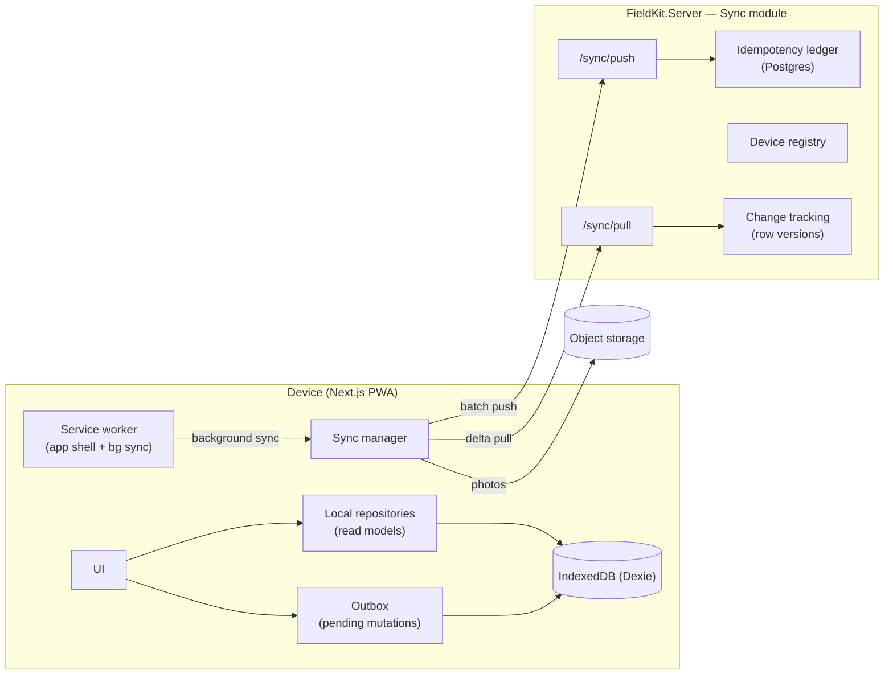
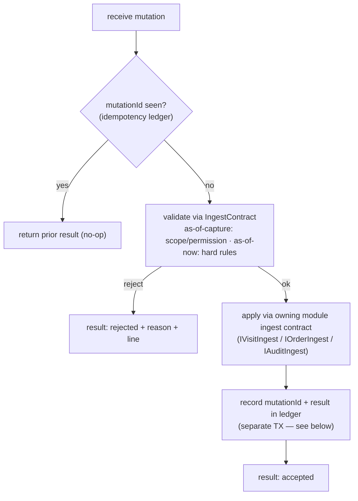

# Offline Sync Engine

> **Status:** ✅ Baseline · **Showcase:** offline-first sync · **Last updated:** 2026-08
> **Decision:** [ADR-0007](adr/0007-offline-sync-strategy.md) · **Functional view:** [offline behavior](../product/30-offline-behavior.md)

This is the hard part, specified. [ADR-0007](adr/0007-offline-sync-strategy.md) chose the
*strategy* (snapshot pull + idempotent outbox push, conflicts designed out); this document is the
*engineering*: the client store, the wire protocol, versioning and watermarks, idempotency,
failure handling, and the server-side machinery.

## 1. Components



- **Local repositories** — typed read models over IndexedDB (outlets, products, prices,
  journeys, templates) the UI reads from; populated by pull.
- **Outbox** — durable queue of pending mutations, each with a client mutation id and status.
- **Sync manager** — orchestrates pull/push/photo upload; triggered on reconnect, background
  sync, or manual.
- **Server Sync module** — exposes `/sync/pull` and `/sync/push`, owns change tracking, the
  device registry, and the idempotency ledger.

## 2. Client storage model (IndexedDB / Dexie)

| Store | Kind | Contents |
|---|---|---|
| `ref_*` (e.g. `ref_outlets`, `ref_products`, `ref_prices`, `ref_journeys`, `ref_templates`) | Reference (read-only) | Territory-scoped snapshot; server-authoritative |
| `outbox` | Mutations | `{ mutationId, type, payload, status, createdAt, attempts, error? }` |
| `blobs` | Binaries | Downscaled photos awaiting upload, keyed by mutation + slot |
| `watermarks` | Sync state | How far the device has been told about one entity |
| `meta` | Sync state | Device id, last sync, snapshot version |

Writes to `outbox`/`blobs` are **synchronous and durable before the UI confirms** — the "no lost
work" guarantee ([OFF-02](../product/30-offline-behavior.md#6-requirements)). Outbox status:
`pending → inflight → failed`, with an accepted mutation **deleted** rather than given a fourth
state.

**Three things the implementation (W8 slice 6, [`lib/sync`](../../frontend/lib/sync)) settled that
this table used to leave open:**

- **One database per tenant *and* signed-in subject**, named `fieldkit:<tenant>:<subject>`. A rep
  signing in on a colleague's tablet gets an empty store rather than the colleague's territory.
  Server-side, tenant isolation is a query filter nobody can bypass; the client equivalent is that
  the data was never in the same database to begin with, rather than a column application code has
  to remember to filter on. It also makes sign-out total: delete the database.
- **There is no `acked` status.** A row whose only content is "this finished" is a table that grows
  for the life of the install with nothing reading it. The record of the work is the visit, which
  the device already holds and the server now agrees about. What survives is the two states somebody
  still has a question about: `pending`, which retries, and `failed`, which needs a person.
- **`watermarks` is its own store, not rows in `meta`.** It is written in the *same transaction* as
  the rows it describes, and that is easier to get right — and to read — against a typed store than
  against a stringly-typed blob.

**`inflight` is durable, and reclaimed on startup.** A device killed mid-push — tab closed, battery
flat, OS reclaiming memory — leaves rows claiming to be in flight on a connection that no longer
exists, and nothing will ever answer them. Startup returns them to `pending`. Re-sending is safe
precisely because the mutation id survived the crash: whatever the server did with the first
attempt, the ledger will say so (§4).

**The blob store is not built yet**, deliberately — photo upload is `OFF-08`/W11, and a store with
no writer is a schema version spent on nothing.

**Durability is bounded by the platform, and we say so.** Browsers — iOS Safari especially — can
**evict** IndexedDB/service-worker storage under pressure or inactivity policies. FieldKit therefore
(1) requires **add-to-home-screen install** for field use (installed PWAs get stronger persistence),
(2) requests **`navigator.storage.persist()`** on first bind and surfaces the result, and (3) treats
a **large or aged unsynced outbox as an at-risk condition** — prompting/forcing a sync and warning
the rep. The durability guarantee is honestly scoped to *"durable within the OS's storage
guarantees, install required"* — not an absolute claim the platform can't keep. This is why the
sync-early triggers (reconnect, background, "Sync now") matter: the shorter the unsynced window, the
smaller the eviction exposure.

## 3. Pull protocol (reference delta)

**Request** carries the device's current watermarks:

```jsonc
POST /sync/pull
{
  "deviceId": "…",
  "cursors": { "outlets": 4192, "products": 8801, "prices": 8790, "journeys": 51120 }
}
```

**Server** returns, per entity type, rows with `rowVersion > cursor`, **filtered to the device's
territory scope** ([A4](../product/decisions-and-assumptions.md#a4--offline-data-scope-territory-scoped)),
plus the new high-water mark and any **tombstones** (deletes/out-of-scope):

```jsonc
{
  "changes": {
    "prices":  { "upserts": [ /* … */ ], "tombstones": [ 8791 ], "cursor": 8830 }
  },
  "snapshotVersion": "2026-08-01T09:12:00Z#8830"
}
```

- **Row version** = a per-tenant monotonic counter stamped on every change, and the single ordering
  primitive. **Not a Postgres sequence** — `nextval()` allocates before commit and never rolls back,
  so a device can bank a cursor past a version still uncommitted and never see that row again
  ([ADR-0013](adr/0013-sync-row-version.md)).
- The client applies upserts/tombstones to `ref_*` and advances the watermark **atomically** per
  entity type, in one IndexedDB transaction (`applyOutletChanges`, W8 slice 6). Written separately,
  either order loses: **cursor first** and a crash advances the device past changes it never stored,
  which are then gone until something unrelated edits them; **rows first** is merely wasteful, and
  only safe because upserts happen to be idempotent. A partial pull is safe — the next one resumes
  from the last committed cursor.
- **Territory changes** (rep reassigned, outlet moved) arrive as tombstones for now-out-of-scope
  rows + upserts for newly-in-scope rows.
- **Scope *entry* needs more than `rowVersion > cursor`.** An entity that moves **into** the
  device's scope may have an *old* row version (below the current cursor), so a pure delta would
  never send it. So Sync tracks the device's **scope set** and, on each pull, diffs it against the
  current scope (resolved via `IRepScope` + `RepAssignmentChanged`/outlet-move events). Entities
  **entering scope** are requested from the change feed as a **full baseline for those specific ids**
  (`rowVersion ≥ 0`, filtered to the entering ids) — *in addition to* the normal
  `rowVersion > cursor` delta for already-in-scope rows. Entities **leaving scope** are tombstoned.
  So `IReferenceChangeFeed` takes `(cursor, scopeDelta)`, and **row version orders content changes
  while the scope diff drives membership** — closing the "newly-in-scope is invisible" hole without
  re-stamping row versions across schemas Sync doesn't own.
- **Snapshot coherence.** Because watermarks advance per entity type, the local store between pulls
  is a *patchwork* (e.g. products@8801, prices@8830), not a uniform point-in-time. This is
  intentional and safe: on-device capture tolerates cross-entity skew because **each order line
  records its own resolved price at capture** (BR-ORD-6) rather than trusting a global "as-of X."
  The `snapshotVersion` a mutation carries is the **high-water mark across the entity types it
  read** — enough for the server to re-price and *flag* drift, not a claim that the whole store was
  uniformly at X.
- **Config coherence exception.** Cross-*referencing* config (a visit-workflow step points at a
  survey-form; a workflow references a weight-set) must not tear. The **Configuration** module ships
  these as a **single versioned bundle** (`ConfigurationSet@version`) applied atomically on the
  device — a partial pull never leaves a workflow step pointing at a not-yet-pulled form. Config is
  the one place we trade patchwork tolerance for bundle atomicity, because its internal references
  would otherwise dangle at render time.

## 4. Push protocol (device-owned mutations)

**Request** is a batch of the rep's captured work:

```jsonc
POST /sync/push
{
  "deviceId": "…",
  "mutations": [
    { "mutationId": "c1a…", "type": "CapturedVisit", "visit": { /* … */ } },
    { "mutationId": "d4f…", "type": "CapturedOrder", "order": { /* … */ } }
  ]
}
```

**A typed property per kind, not a `payload` blob.** Each mutation type adds its own optional
property, which is additive — a device that only knows `visit` keeps working when `order` lands — and
keeps the request describable in OpenAPI, which an opaque blob would not. `snapshotVersion` is not
accepted yet: nothing reads it until as-of-capture validation exists (see below), and a field the
server ignores is a promise it is not keeping.

**Server processing**, per mutation:



**Response** is a per-mutation result set — partial success is normal:

```jsonc
{
  "results": [
    { "mutationId": "c1a…", "status": "accepted" },
    { "mutationId": "d4f…", "status": "rejected",
      "reason": "visit.ingest.outletUnknown",
      "detail": "That outlet does not exist for this tenant." }
  ]
}
```

- **Idempotency:** `mutationId` is checked in a ledger (a Postgres table, unique on tenant +
  device + mutation id; no cache — [ADR-0007 amendment](adr/0007-offline-sync-strategy.md#amendment-2026-08-the-ledger-is-postgres-and-there-is-no-redis)). A
  redelivered mutation returns its **prior recorded result** and applies nothing — exactly-once
  *effect* over at-least-once *delivery*. The ledger is **retained at least as long as the maximum
  offline + retry window** (a very late retry must still dedupe); entries older than that horizon are
  pruned. `mutationId` dedupes *transport* re-delivery, not a client that mints two ids for one
  intent — if accidental double-capture matters, the field module adds a business key.
- **Apply through the ingest contract, not tables:** Sync calls `IVisitIngest`/`IOrderIngest`/
  `IAuditIngest` so all domain invariants run server-side — Sync never writes another module's schema
  ([module boundaries §7](10-module-boundaries.md#7-module-registry)).
- **The work and its ledger entry commit separately, and the device-minted id is what makes that
  safe.** This document used to say "same TX". It cannot be: schema-per-module
  ([ADR-0005](adr/0005-persistence-postgres-schema-per-module.md)) means Visit and Sync own separate
  `DbContext`s, so an ingest that deferred its save would leave the work in a change tracker Sync
  never commits. Two saves leave a window — the visit stored, the ledger entry lost to a crash — and
  the device's retry arrives looking new. It is closed one level down: the **entity id is minted on
  the device**, so the ingest finds the record already there and answers `AlreadyExists`, which the
  push endpoint reads as *this already succeeded* and records as accepted. The effect is exactly-once
  without a distributed transaction, and it is why every pushed record carries a client-minted id.
- **Validation is as-of-capture for scope, as-of-now for hard rules.** A rep reassigned or
  scope-changed *during* the offline window did legitimate work — so **permission/territory** checks
  are evaluated **as-of-capture** (the snapshot version the mutation carries), while **hard business
  rules** (outlet closed, SKU discontinued) are **as-of-now**. This avoids wrongly rejecting valid
  work while still catching genuine conflicts. *As shipped in W8 slice 5 there is no as-of-capture
  half yet* — a push runs the as-of-now rules (the outlet exists, the outcome parses, a
  non-productive visit says why) and no territory check at all, because a rep pushing their own
  captured work is not asking to reach anything they did not already hold. Where the same visit's
  **geofence assessment** is concerned the rule is stronger than as-of-capture: the device's verdict
  is stored **unmodified**, never recomputed, because the outlet's radius may have moved since and
  re-judging would reclassify a rep who was legitimately inside it.
- Client marks `accepted` mutations `acked` (removed); transient failures stay `pending` and retry
  with backoff. A **`rejected`** result becomes a **"needs attention"** item ([OFF-09](../product/30-offline-behavior.md#6-requirements));
  for an **order**, rejection is whole-order and **re-opens the order editable on the device** so the
  rep fixes the flagged line and resubmits under a **new mutation id** — the original id stays
  terminal, so the push remains idempotent and no work is stranded (**resolves finding S1**;
  [BR-ORD-9](../product/23-order-capture.md#5-business-rules)).

## 5. Photo (binary) upload — out of band

```mermaid
sequenceDiagram
  participant SM as Sync manager
  participant API as Sync API
  participant OBJ as Object storage
  SM->>API: request presigned URL (mutationId, slot, contentHash)
  API-->>SM: presigned PUT url
  SM->>OBJ: PUT downscaled JPEG (retry-safe, idempotent by key)
  SM->>API: confirm upload (object key)
  Note over SM,API: audit record already synced; photo attaches when it lands
```

Photos ([B5](../product/decisions-and-assumptions.md#b5--photo--binary-sync)) upload
**independently** of the JSON push and can lag it; the audit references the object key, resolved
when the upload confirms. Failures retry without blocking data sync. **Terminal case:** if a device
is wiped before a pending photo lands, the already-accepted audit holds an object key that never
materializes — the server reconciles a **missing-blob** flag on the audit (the audit's structured
data is authoritative; the photo is evidence, so its loss degrades but does not invalidate the
record).

## 6. Triggers & scheduling

Per [A8](../product/decisions-and-assumptions.md#a8--device--sync-behavior-one-active-device-auto-background-sync):

| Trigger | Mechanism | Guarantee |
|---|---|---|
| Reconnect | `online` event → sync manager | Primary guarantee |
| Manual "Sync now" | User action | Always available |
| Periodic background | Background Sync API where supported | Best-effort (iOS PWA-limited) |

**Order of operations** on a sync run: **push** pending mutations → **pull** reference deltas →
**upload** photos. (Push first so the back office sees the day's work as early as possible.)

## 7. Device lifecycle

- **Bind:** first login on a device registers it (device registry); one active device per rep —
  registering a new device **deactivates the prior one**. Bind triggers a **full territory
  snapshot** (all watermarks from zero).
- **Reset/rebind:** a deactivated device is blocked from **pull/bind** with `DEVICE_INACTIVE` and
  prompts re-bind (and re-snapshots). Only pull/bind is exclusive to the active device.
- **Final drain-push (resolves finding S2):** a deactivated device may still complete **one final
  push** of its append-only outbox before it is hard-blocked. A rep can lose signal for a full day
  and be re-bound to a replacement before reconnecting; without the drain, that day's visits/orders/
  audits would be stranded — violating "No lost work, ever." Because transactional data is
  device-owned, append-only, and idempotent by `mutationId`, an old-device drain-push **cannot cause
  split-brain** (there is no competing writer for those records). So exclusivity applies to pull/bind,
  not to draining already-captured work. ([A8](../product/decisions-and-assumptions.md#a8--device--sync-behavior-one-active-device-auto-background-sync))
- **Compromised vs swapped (security).** Deactivation has **two modes**: **swap** (rep got a new
  phone) allows the one final drain-push above; **compromised** (lost/stolen) **blocks the drain
  too** — a suspect device must not push fabricated visits/orders. The admin picks the mode; the
  drain window is **bounded** (drain must complete within a short deadline of deactivation, else the
  device is hard-blocked). ([security §5](16-security.md#5-device--offline-security))
- **Rejected orders survive a swap (S1 × S2).** The outbox holds only *submitted* mutations, so a
  drain does **not** carry a Draft or a re-opened-editable rejected order — those are local state.
  To keep S1's guarantee across a swap, a **rejected order is retained server-side in `Rejected`
  state** and is **pulled back to the rep's active device** (it is the rep's own record) into an
  editable state. So remediation is not stranded on a dead device: the correction can be finished on
  the new device. (This is the one transactional record that flows *down* — deliberately, because it
  needs an owner after a swap.)
- **Drafts are best-effort.** An *unsubmitted* Draft (never pushed) is local-only and **does not
  survive a device swap** — the app nudges the rep to submit before rebind, but a lost device loses
  an in-progress draft. The "**no lost work**" guarantee is therefore scoped honestly to
  **captured/submitted** work (checked-out visits, submitted orders/audits), not to in-progress
  drafts. Stated plainly rather than overclaimed.
- **Duplicate visits after a swap.** If the old device completed a visit that hadn't synced when the
  new device (whose snapshot shows the planned visit as un-worked) re-visits, two *actual* visits
  attach to one *planned* visit. That's legitimate (two visits/day is allowed), and it does **not**
  double-count coverage: **coverage/frequency is measured per *planned visit* (covered / not), not
  per actual-visit count** — so reporting stays correct; the extra visit is just a second call.
- **Offline-store migration:** a PWA app update that changes the IndexedDB schema must migrate the
  local store **while preserving a non-empty outbox** — outbox/blob records are versioned and
  migrated forward before any new-schema read, so an app update mid-offline-day never drops pending
  work.

## 8. Failure & edge-case handling

| Scenario | Behavior |
|---|---|
| Connection drops mid-push | Un-acked mutations stay `pending`; next run re-sends; idempotency prevents doubles. |
| Connection drops mid-pull | Watermark only advanced for fully-applied entity types; resumes cleanly. |
| App killed mid-visit | Everything captured is already durable in IndexedDB; resumes on reopen ([OFF acceptance](../product/30-offline-behavior.md#8-acceptance-criteria-sample)). |
| Server rejects a mutation | Per-mutation `rejected` + reason + line; siblings still succeed. Orders **re-open editable** for correction & resubmission under a new id (S1). |
| Device swapped with unsynced work | Deactivated device does a final **drain-push** of its append-only outbox (S2) — no lost work, no split-brain. |
| Master data changed while offline | Server-wins on next pull; captured txns keep their `snapshotVersion`; re-price delta **flagged** not applied. |
| Config definition changed while offline | Value validated **as-of-capture** against the definition version it was captured under; a genuinely invalid value rejects → editable order/needs-attention (never silently dropped). |
| Clock skew on device | Server stamps authoritative `rowVersion`/timestamps; device clock never orders server data. **One exception:** promotion validity is evaluated on-device in the outlet's timezone at capture (BR-PRD-6), so a badly skewed clock could apply an out-of-window promo — the server **flags** the mismatch on re-price (BR-ORD-6), it does not silently accept. |
| IndexedDB quota pressure | Reference snapshot is small (territory-scoped, [B6](../product/decisions-and-assumptions.md#b6--scale-assumptions-representative-not-limits)); quota warnings surfaced ([OFF-11](../product/30-offline-behavior.md#6-requirements)). |

## 9. Why this is correct (the invariants)

The engine's guarantees rest on a few invariants, stated so they can be defended and tested:

1. **Reference data is server-authoritative and read-only on device** → pulls never conflict.
2. **Transactional data is device-owned and append-only** → pushes have no competing writer.
3. **Mutations are idempotent by `mutationId`** → at-least-once delivery yields exactly-once effect.
4. **Row version is monotonic per tenant** → watermarks give a total order for deltas.
5. **Records that could be co-edited are locked/sealed** → the two-writer case cannot arise.

Break any one and conflicts reappear — so [architecture tests](17-testing-strategy.md) and the
domain rules (visit sealed on checkout, order locked on submit) guard them explicitly. Together
they let a genuinely hard distributed-data problem be solved without CRDTs — the central claim of
[ADR-0007](adr/0007-offline-sync-strategy.md).

## 10. Test plan (summary)

- **Property/fuzz:** random connect/drop during push & pull ⇒ no duplicates, no lost mutations,
  convergent state.
- **Idempotency:** replay the same batch N times ⇒ identical server state and results.
- **Kill-during-capture:** process kill mid-visit ⇒ full recovery on reopen.
- **Territory reassignment:** scope change ⇒ correct tombstones + upserts; no stale data lingers.
- Details in the [testing strategy](17-testing-strategy.md).
