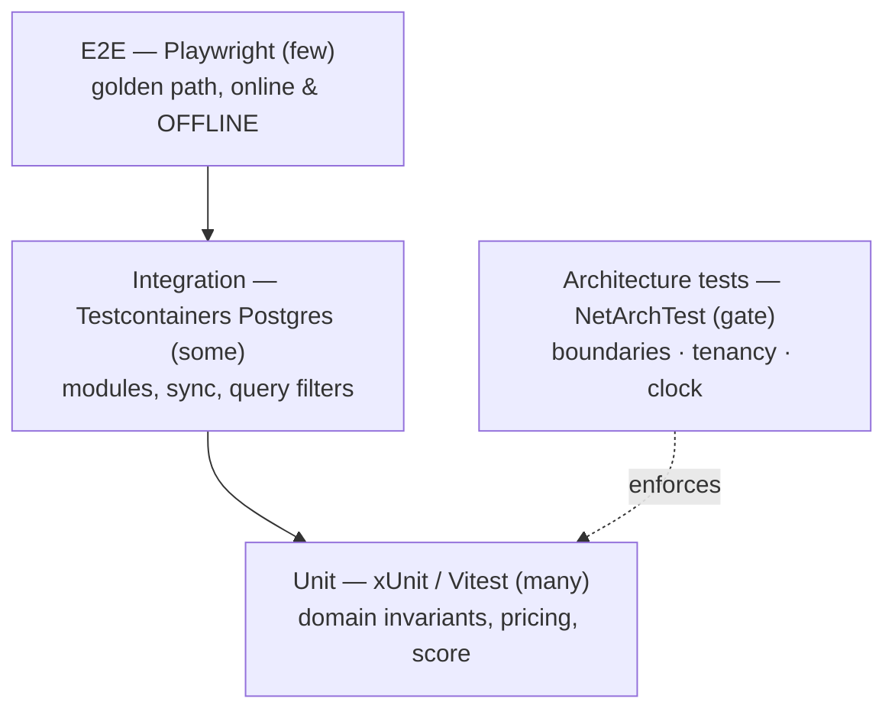

# Testing Strategy

> **Status:** ✅ Baseline · **Last updated:** 2026-08

FieldKit's tests exist to protect the things that make it correct: **module boundaries**, **tenant
isolation**, the **deterministic pricing engine**, and the **offline sync guarantees**. The CV
calls out unit, E2E, and test automation — this is where that's made concrete. The shape is a
pyramid with one extra, unusual layer: **architecture tests**.

## 1. The test pyramid (+ arch tests)

## 2. Unit tests (many)

- **Domain invariants** — visit seals on checkout, order locks on submit, territory single-active-
  rep, etc. ([domain model](11-domain-model.md)).
- **Pricing/promotion engine** — the deterministic core, tested as a pure function across price
  specificity, promotion types, tax, currency. The same vectors run against the C# engine and the
  TypeScript device mirror to prove they agree ([BR-PRD-7](../product/13-products-and-pricing.md#5-business-rules)).
  Vectors are **generated / property-based** (not only hand-written) so uncovered input regions
  can't hide drift, and the TS side runs on a **decimal library with the documented rounding policy**
  — the specific defense against JS float64 vs `System.Decimal` divergence ([BR-PRD-8/9](../product/13-products-and-pricing.md#decimal-parity-resolves-finding-s4)).
  They live in [`vectors/`](../../vectors/README.md) — outside both projects, because neither owns
  them. Price resolution (`PRD-04`) landed there first, hand-written, one case per rule; the
  generated suite fills the same format without the mirror having to change.
  > **Generated and property-based are not two names for one thing, and the distinction decides what
  > each can catch.** Generated vectors take their expectations *from the C# engine*, so replaying
  > them against C# is circular — a bug is generated into the file and then confirmed by it. Their
  > value is entirely as an **oracle for the TypeScript mirror**, across input regions nobody would
  > hand-write. What tests C# is the hand-written cases (which encode the rules, decided before the
  > code) and the **properties** — statements needing no expected answer, like *net + tax = gross* or
  > *resolution does not depend on candidate order*. The mirror should reimplement the properties
  > rather than read them: a vector file transfers answers, a property transfers a rule.
  >
  > The committed generated files are checked against the generator on every run, because committed
  > output goes stale silently — and a mirror proving itself against a file describing last month's
  > engine is precisely the drift this apparatus exists to catch, arriving through the apparatus.
- **Perfect-store scoring** — weighted score across pillars, under the **same decimal-parity regime
  as pricing** (decimal lib + rounding + **generated C#≡TS vectors**): share-of-shelf ratios and
  weighted sums are a second float-vs-decimal divergence surface (BR-AUD-5/12, [Audit](../product/22-merchandising-and-audits.md)).
- Front-end units in **Vitest** (components, local-store repositories, outbox logic).
  - **Components render for real**, through Testing Library in jsdom, with the **real message
    catalog** — a stubbed `useTranslations` that echoes its key makes every missing-translation test
    pass and deletes the assertion it looked like it was making.
  - Queried **by role and by text**, never by test id or class name: what a test asserts should be
    what a person can perceive, which is also what makes the assertions double as accessibility
    checks. "There is no link to Dashboard" is a fact about the product; `.navi.disabled` is a fact
    about the stylesheet.
  - jsdom is **opt-in per file** (`@vitest-environment jsdom`). Most of this suite asserts over pure
    modules and has no use for a DOM; making every file pay for one costs seconds on a suite that
    runs in single digits.

## 3. Integration tests (some) — real Postgres

- Run against **PostgreSQL via Testcontainers** (never in-memory) so **query filters, JSONB,
  PostGIS, migrations, and the outbox** behave as in prod ([data & persistence](14-data-and-persistence.md)).
- Cover: module use-cases end to end through their contracts, cross-module **integration events**
  (publish → outbox → handler), and the **sync pull/push** endpoints.
- **Tenant-isolation tests:** seed two tenants; assert every list/read returns only the current
  tenant's rows and that a crafted cross-tenant id yields not-found, not data.

## 4. Architecture tests (the gate)

Executable boundary rules that fail the build ([module boundaries §5](10-module-boundaries.md#5-enforcement--architecture-tests)):
no module→module internal references, contracts-only public surface, no entity leakage, DbContext-
maps-own-schema, **no `IgnoreQueryFilters`/raw tenant-bypass**, `IClock`-only time. These make the
architecture *self-enforcing* rather than convention.

## 5. Sync engine tests (the hard part) — property-based

The offline guarantees ([sync engine §9-10](12-offline-sync-engine.md)) get dedicated,
adversarial testing:

| Test | Asserts |
|---|---|
| **Chaos connectivity** (property/fuzz) | Random connect/drop during push & pull ⇒ no duplicates, no lost mutations, convergent state |
| **Idempotency replay** | Same batch pushed N times ⇒ identical server state & results |
| **Kill-during-capture** | Process kill mid-visit ⇒ full recovery from IndexedDB on reopen |
| **Territory reassignment** | Scope change ⇒ **newly-in-scope rows arrive as a baseline even with old row-versions** (scope-diff path, not just `rowVersion > cursor`); out-of-scope tombstoned; no stale local data; pre-reassignment work still accepted (as-of-capture) |
| **Watermark resume** | Interrupted pull ⇒ resumes from last committed cursor, no gaps |
| **Rejected-order pull-back** (S1×S2) | Rejected order retained server-side, pulls to the rep's **new** device after swap ⇒ remediation survives the swap |
| **Rejected-order re-open** (S1) | A hard-rejected order re-opens editable; resubmit under a new id ⇒ accepted once, original id terminal, no duplicate |
| **Device-swap drain** (S2) | Deactivated device drain-pushes its outbox ⇒ no lost work, no split-brain with the new device |
| **Local-store migration** | App update changing IndexedDB schema ⇒ pending outbox preserved and migrated |

## 6. E2E tests (few) — Playwright

- The **golden path** ([product overview §5](../product/00-product-overview.md#5-a-day-in-the-life-the-golden-path))
  end to end: admin sets up master data → rep syncs → **goes offline** → visit + audit + order →
  reconnect → back office sees results.
- Offline is exercised by **toggling network conditions** in Playwright to prove the field flow
  works with no connectivity and reconciles on reconnect.

## 7. What is deliberately *not* heavily tested

Stated honestly: exhaustive back-office CRUD permutations, Keycloak itself (trusted dependency),
and visual regression beyond a smoke level. Effort concentrates on the correctness-critical core.

## 8. CI

GitHub Actions on every PR: **build → unit → architecture tests → integration (Testcontainers) →
E2E (golden path)**. Architecture and tenant-isolation tests are **required checks** — a boundary
or isolation regression cannot merge ([roadmap Phase 0](../roadmap.md)).
