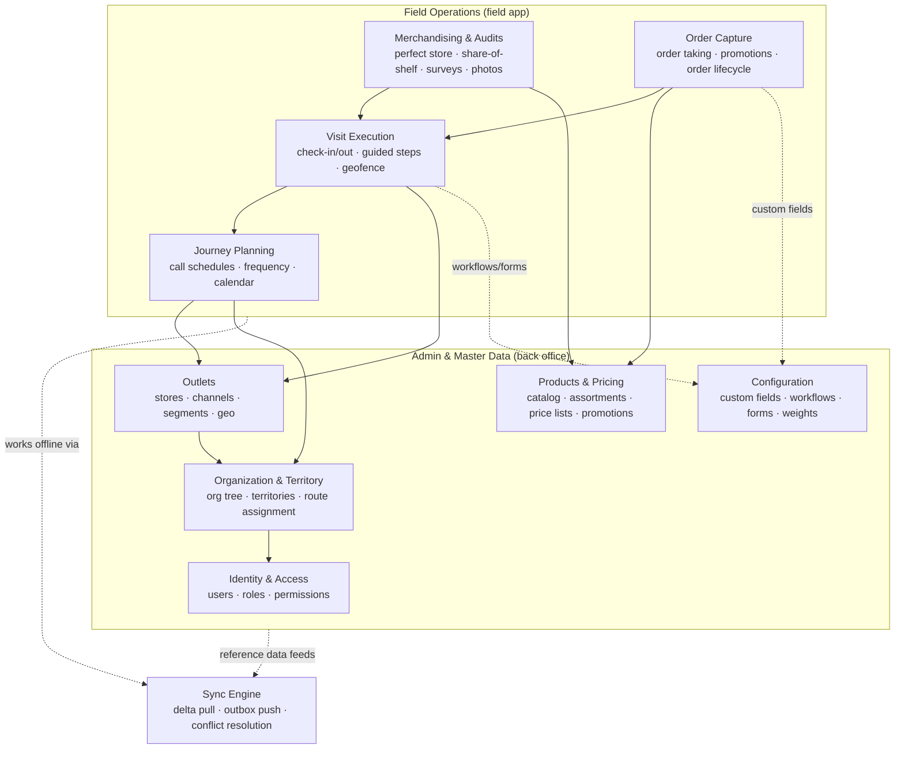

# Product Overview

> **Status:** ✅ Baseline · **Owner:** Tiberiu Socea · **Last updated:** 2026-07

## 1. What FieldKit is

FieldKit is a **Sales Force Automation (SFA)** platform for consumer-goods (FMCG/CPG)
companies whose revenue depends on getting product onto the right shelves, in the right
place, at the right price, in tens of thousands of retail outlets they do not own.

The people who make that happen are **field sales reps** who spend their day driving a
territory, walking into stores, checking the shelf, fixing what's wrong, and taking the
next order. FieldKit is the tool in their hand and the platform their managers run the
operation from.

It has two faces:

- **The field app** — an offline-first Next.js PWA the rep uses inside the store, often
  with no signal. Journey for the day, guided store visit, shelf audit, order capture.
- **The back office** — a web console where sales ops and admins manage the trade universe:
  outlets, products, prices, promotions, territories, users, and the rules that drive the
  field app.

## 2. Why this project exists

FieldKit is a portfolio project. Its purpose is to demonstrate **senior full-stack and
architectural capability** on a domain I know professionally, while deliberately closing
gaps and adding modern, in-demand skills:

| Capability demonstrated | How FieldKit shows it |
|---|---|
| System architecture at scale | A **modular monolith** with enforced module boundaries, DDD-style domains, and a monolith-first / microservices-ready posture |
| Cloud-native .NET | **.NET Aspire** orchestrating the API, front end, PostgreSQL, and Redis with first-class observability |
| Modern front end | **Next.js** (App Router) as an installable, **offline-first PWA** |
| Hard distributed-systems problem | A purpose-built **offline sync engine** — local store, outbox, delta pull, idempotent push, conflict resolution |
| Production discipline | OpenTelemetry, health checks, architecture tests, integration tests on real Postgres, E2E, CI/CD |

The domain is not incidental: field sales is a genuinely offline, genuinely multi-tenant,
genuinely rules-heavy problem. It justifies the architecture instead of decorating it.

## 3. Personas

| Persona | Role | Primary surface | What they need |
|---|---|---|---|
| **Maria — Field Sales Rep** | Visits ~25 outlets/day on a route | Field app (mobile PWA, offline) | A fast, reliable in-store flow that never loses her work when signal drops |
| **Andrei — Sales Supervisor** | Manages a team of reps in a region | Back office + field app | Visibility into coverage & compliance; ability to adjust journeys (KPI *targets* are a future Could — no module owns them in v1) |
| **Elena — Sales Ops / Admin** | Owns master data & platform config | Back office | Accurate outlets, products, prices, promotions; user & territory administration |
| **Victor — Tenant Administrator** | IT/admin for a customer (a brand/distributor) | Back office (admin) | User provisioning, roles, and tenant-level settings |

FieldKit is **multi-tenant**: each customer (a brand or distributor) is an isolated tenant.
Personas above exist *within* a tenant.

## 4. Capability map

FieldKit is organised into modules that map 1:1 to the [architecture module
decomposition](../architecture/00-architecture-overview.md#4-module-decomposition). Two
groups: **admin / master data** (back office) and **field operations** (field app).

### Capability summary

| # | Capability | Group | Phase | One-liner |
|---|---|---|---|---|
| C1 | Identity & Access | Admin | 1 | Authenticate users; assign roles/permissions within a tenant |
| C2 | Organization & Territory | Admin | 1 | Model the sales org and carve the country into territories/routes |
| C3 | Outlets (master data) | Admin | 1 | Maintain the universe of retail outlets a rep can visit |
| C4 | Products & Pricing | Admin | 2 | Maintain catalog, assortments, price lists, and promotions |
| C5 | Configuration (customization) | Admin | 1→3 | Per-tenant custom fields, visit workflows, survey forms, perfect-store weights |
| C6 | Journey Planning | Field | 2 | Generate each rep's daily journey from frequency & territory rules |
| C7 | Visit Execution | Field | 2 | Guide the rep through a structured in-store visit |
| C8 | Merchandising & Audits | Field | 3 | Capture shelf state: availability, share-of-shelf, surveys, photos |
| C9 | Order Capture | Field | 3 | Take orders against assortment & price, apply promotions |
| C10 | Offline Sync | Cross-cutting | 2 | Everything above keeps working with no connectivity |

### Reporting & KPIs (cross-cutting read-side)

Reporting is **not** a separate write-module. Supervisor and ops dashboards are composed from
the **query contracts** each module already exposes (`IVisitQuery`, `IAuditQuery`,
`IOrderQuery`, journey coverage, etc.) plus integration events — which is why the module specs
say "→ reporting" without a reporting module existing. The headline KPIs:

| KPI | Source module(s) |
|---|---|
| Coverage / visit compliance (planned vs. actual, frequency adherence) | Journey, Visit |
| Strike rate (productive visits ÷ visits) | Visit, Order |
| Perfect-store score & pillar breakdown | Audit |
| Order value / lines / promotion usage | Order |
| Outlet / territory health | Outlets, Organization |

Operational dashboards only — no OLAP/warehouse ([non-goal](#6-scope--non-goals)). Richer
metrics and custom KPIs land in Phase 3–4 ([roadmap](../roadmap.md)).

## 5. A day in the life (the golden path)

1. **Night before / on connect** — FieldKit syncs Maria's device: today's journey, her
   outlets, the current product catalog, prices, promotions, and planograms are pulled as a
   versioned snapshot into local storage. She can now go fully offline.
2. **Arrive at outlet** — She checks in; a geofence confirms she's actually at the store.
   The visit opens with a checklist of steps configured for that outlet's channel.
3. **Audit the shelf** — She runs the perfect-store audit: is the planogram respected, are
   the must-stock SKUs present, what's the price on shelf, take photos. All stored locally.
4. **Take the order** — She captures an order against the outlet's assortment; prices and
   promotions are computed on-device from the synced data.
5. **Check out** — The visit closes with a summary and time on site.
6. **Reconnect** — When signal returns, the outbox pushes her visits, audits, and orders to
   the server (idempotently), and pulls any new reference data. Conflicts are resolved by
   documented rules. Her manager sees coverage and compliance update in the back office.

## 6. Scope & non-goals

**In scope (spec'd; built in phases — see [roadmap](../roadmap.md)):**
- Multi-tenant admin platform for the SFA master data and configuration above.
- Offline-first field app covering the golden path end to end.
- The offline sync engine as a first-class, documented subsystem.
- Observability, security, and testing as production concerns.

**Non-goals (explicitly out — kept honest so the architecture stays focused):**
- **Native mobile apps.** The field app is a PWA. (Real-world FieldKit-like products often
  add native; here the PWA proves the offline story without a second codebase.)
- **ERP / logistics / fulfillment.** Orders are captured, not fulfilled, invoiced, or
  delivered. FieldKit ends at "order submitted".
- **Van sales / van-stock.** FieldKit is **pre-sell** (take an order for later delivery), not
  **van-sell** (sell-and-deliver from on-hand van inventory). Van-stock tracking is a distinct mode,
  explicitly out — a different claim than "no fulfillment".
- **Route optimization / VRP solving.** Journeys are generated from frequency & territory
  rules, not from a vehicle-routing optimizer.
- **Advanced BI / data warehouse.** Operational dashboards only; no OLAP stack.
- **Payment processing.** Out of scope entirely.

These non-goals are revisitable, but every one of them is a place the project could sprawl,
so they are stated up front.

## 7. Glossary

| Term | Meaning |
|---|---|
| **SFA** | Sales Force Automation — software that runs field sales operations |
| **FMCG / CPG** | Fast-Moving Consumer Goods / Consumer Packaged Goods |
| **Outlet / POS** | A retail point of sale the rep visits (store, kiosk, supermarket) |
| **Trade channel** | A classification of outlets (e.g. modern trade, traditional trade, HoReCa) |
| **Journey / route** | The ordered list of outlets a rep is scheduled to visit in a day |
| **Call frequency** | How often an outlet should be visited (e.g. weekly, F1/F2) |
| **Visit / call** | A single in-store engagement by a rep |
| **Assortment** | The set of products an outlet is expected/allowed to carry |
| **Planogram** | The prescribed layout of products on the shelf |
| **Perfect store** | A scoring model for how well an outlet meets merchandising standards |
| **Must-stock list (MSL)** | SKUs that must be present in a given outlet |
| **Outbox** | Local queue of changes made offline, awaiting push to the server |
| **Watermark** | A per-entity version marker the client uses to pull only new changes |
| **Tenant** | An isolated customer of FieldKit (a brand or distributor) |

## 8. Related documents

- [Architecture overview](../architecture/00-architecture-overview.md)
- [ADR-0002: Modular monolith](../architecture/adr/0002-modular-monolith.md)
- [Roadmap](../roadmap.md)
